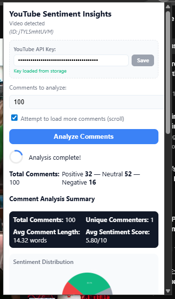
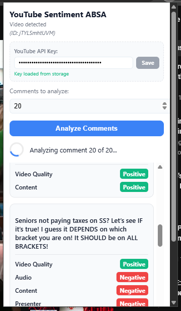

# 🎥 YouTube Sentiment Analysis MLOps Pipeline


An end-to-end **MLOps Production Pipeline** that delivers real-time sentiment insights for YouTube comments. This project demonstrates strict engineering standards, automating the journey from data ingestion to model deployment using **DVC**, **MLflow**, and **Docker**.

---

## 🚀 Project Overview

This system allows content creators to instantly gauge audience reaction through two bespoke **Chrome Extensions**. Behind the scenes, a robust MLOps pipeline orchestrates data versioning, experiment tracking, and automated deployment.

*   **Real-time Analysis:** Process comments instantly as you browse YouTube.
*   **Deep Insights:** Go beyond "Likes" with aggregated sentiment trends, word clouds, and Aspect-Based Sentiment Analysis (ABSA).
*   **Production Grade:** Built with reproducibility, scalability, and CI/CD at its core.

### 📸 Extension Previews

<div align="center">
  
  
  <p><i>Left: Standard Sentiment Insights | Right: Aspect-Based Sentiment Analysis</i></p>
</div>

---

## 🏗 System Architecture

The ecosystem relies on three synchronized layers:

1.  **🧠 Data & Modeling**:
    *   **DVC**: Versions datasets (`.dvc`) and defines the reproducible DAG pipeline (`dvc.yaml`).
    *   **MLflow**: Tracks experiments and manages the Model Registry ("Production" alias).
2.  **⚙️ Inference Core**:
    * **FastAPI:** Serves the trained models via a high-performance REST API. It exposes two main endpoints:
      - `/predict`: For the general sentiment model.
      - `/predict_absa`: For the aspect-based sentiment model.
    *   **Inference API (Port 8000)**: Serves LightGBM/XGBoost predictions and ABSA.
    *   **Insights API (Port 8001)**: Generates visualizations (Charts, Word Clouds).
    *   **Docker**: Containerizes these services for consistent deployment.
3.  **🖥️ Presentation**:
    *   **Chrome Extensions**: JavaScript frontends injecting insights directly into YouTube's UI.

---

## ✨ Key Features

| Feature | Description |
| :--- | :--- |
| **Dual-Model Strategy** | **LightGBM/XGBoost** for speed (General Sentiment) + **BERT** for granularity (ABSA). |
| **Automated Pipeline** | `dvc repro` executes the full DAG from ingestion to registration. |
| **Strict CI/CD** | GitHub Actions pipeline for Linting, Testing, Security Scanning (Trivy), and Docker Build. |
| **Lazy Loading** | APIs utilize "lazy loading" to ensure instant startup, initializing heavy models only when needed. |
| **Experiment Tracking** | Full hyperparameter and metric logging via MLflow. |

---

## 🏃‍♂️ Usage Guide (Run Locally)

Follow these steps to get the full stack running on your machine.

### 1. Prerequisites
- Python 3.11+
- `uv` (Universal Package Manager)
- Docker (Optional, for containerized run)

### 2. Installation
```bash
# Clone the repo
git clone https://github.com/SebastianGarrido2790/Youtube-Sentiment-MLOPS.git
cd Youtube-Sentiment-MLOPS

# Install dependencies (fast!)
uv sync

# Pull DVC data (if you have AWS credentials configured)
uv run dvc pull
```

### 3. Start Backend Services
You need to run **three** processes. Open separate terminals for each:

**Terminal 1: MLflow Server** (Dependencies & Model Registry)
```bash
uv run python -m mlflow server --host 127.0.0.1 --port 5000
```

**Terminal 2: Inference API** (Handles ABSA & Core Predictions)
```bash
uv run python -m app.main
# Runs on http://127.0.0.1:8000
```

**Terminal 3: Insights API** (Handles Visualizations & Dashboard)
```bash
uv run python -m app.insights_api
# Runs on http://127.0.0.1:8001
```

### 4. Setup Chrome Extensions
To see the insights on YouTube, you need to load the extensions into your browser.

#### A. Create a YouTube Data API Key
1. Go to the [Google Cloud Console](https://console.cloud.google.com/).
2. Create a new project (e.g., "YouTube-Sentiment").
3. Navigate to **APIs & Services > Library**.
4. Search for **"YouTube Data API v3"** and enable it.
5. Go to **Credentials** -> **Create Credentials** -> **API Key**.
6. **Copy this key**. You will paste it into the extension popup.

#### B. Load the Extensions in Chrome
1. Open Chrome and navigate to `chrome://extensions/`.
2. Toggle **Developer mode** (top right corner) to **ON**.
3. **Standard Insights Extension**:
   - Click **Load unpacked**.
   - Select the `chrome-extension/` folder in this project.
4. **ABSA Extension**:
   - Click **Load unpacked** again.
   - Select the `chrome-extension-absa/` folder.

#### C. Use It!
1. Go to any YouTube video.
2. Click the extension icon in your toolbar.
3. Paste your **Google API Key** when prompted.
4. Click **Analyze** to see real-time sentiment insights!

---

## 🐳 Docker Deployment

For a production-ready setup, use Docker Compose to spin up everything at once.

```bash
cd docker
docker-compose up --build -d
```
This launches:
- **API** at `http://localhost:8000`
- **Insights** at `http://localhost:8001`
- **MLflow** at `http://localhost:5000`

---

## 🛠 Tech Stack

| Component | Technology |
| :--- | :--- |
| **Language** | Python 3.11.9, JavaScript (Vanilla) |
| **Package Manager** | `uv` (Rust-based, extremely fast) |
| **Frameworks** | FastAPI, Pandas, Scikit-Learn, PyTorch |
| **MLOps** | DVC (Data), MLflow (Experiments), Docker (Containers) |
| **CI/CD** | GitHub Actions (Test, Lint, Security Scan, Deploy) |
| **Cloud** | AWS (ECR, EC2, S3) |

---

## 📄 License

Distributed under the MIT License. See `LICENSE.txt` for more information.

## 🤝 Contact

**Sebastian Garrido**  
[LinkedIn](https://www.linkedin.com/in/sebastiangarrido) | [GitHub](https://github.com/SebastianGarrido2790)
