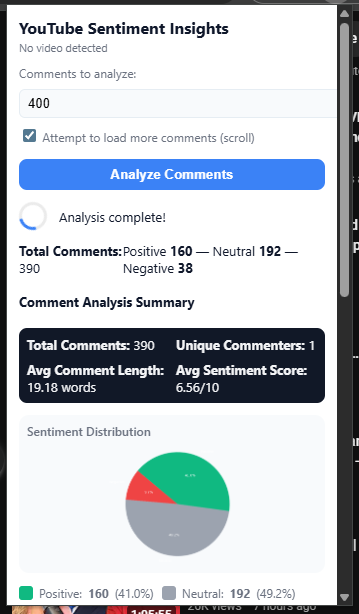

# YouTube Sentiment Analysis
## Project Overview
The **YouTube Sentiment Analysis** project builds an end‑to‑end MLOPS pipeline for extracting, cleaning, engineering, training, evaluating, and deploying a sentiment model on YouTube video metadata and comments. The goal is to provide actionable insights for content creators and platform stakeholders by predicting audience sentiment and engagement.
The project addresses the lack of automated sentiment tools for YouTube data, enabling data‑driven decisions, trend analysis, and content optimisation.
## Table of Contents
- [Project Overview](#project-overview)
- [Installation](#installation)
- [Dataset](#dataset)
- [Preprocessing](#preprocessing)
- [Model Architecture](#model-architecture)
- [Training](#training)
- [Evaluation](#evaluation)
- [Results](#results)
- [Visualizations](#visualizations)
- [Deployment](#deployment)
- [Contributing](#contributing)
- [License](#license)
- [Contact](#contact)
## Installation
```bash
# Create a fresh environment
uv venv .venv
.venv\Scripts\activate  # Mac: source .venv/bin/activate
# Install dependencies
uv sync  # pyproject.toml
uv pip install -r requirements.txt
# (Optional) GPU support
pip install torch==2.3.0+cu118 torchvision torchaudio --index-url https://download.pytorch.org/whl/cu118
```
The project uses **uv** for fast dependency resolution and virtual‑environment management. Ensure `uv` is installed globally (`pip install uv`).  
## Dataset
The dataset is a curated collection of YouTube video metadata and comments sourced via the YouTube Data API. It is stored in `data/raw/` as a CSV file `youtube_comments.csv` with the following columns:
| Column | Description |
|--------|-------------|
| `video_id` | Unique video identifier |
| `title` | Video title |
| `description` | Video description |
| `comment_text` | Comment body |
| `published_at` | Timestamp |
| `like_count` | Number of likes |
| `dislike_count` | Number of dislikes |
Pre‑processing steps include:
- Removing non‑English comments.
- Deduplication of comments.
- Normalising timestamps.
The processed dataset is saved in `data/processed/`.
## Preprocessing
The preprocessing pipeline is implemented in `src/features/feature_engineering.py` and consists of:
1. **Text cleaning** – lowercasing, removing URLs, emojis, and special characters.
2. **Tokenisation** – using `nltk` or `spaCy`.
3. **Feature extraction** – TF‑IDF vectors, sentiment lexicon scores, and metadata embeddings.
- **ADASYN Oversampling** – Best method from `imbalance_tuning` (F1‑positive: 0.7333).
The pipeline is executed via the `preprocess.py` script (see `scripts/` if available).
## Model Architecture
| Model | Description | Hyperparameters |
|-------|-------------|-----------------|
| Logistic Regression | Baseline linear classifier | `C=1.0`, `penalty='l2'` |
| BERT Fine‑tuning | Transformer‑based text classifier | `epochs=3`, `batch_size=32`, `learning_rate=2e-5` |
| Hyperparameter Tuning | Grid search over `C` and `max_features` | `C=[0.1,1,10]`, `max_features=[5000,10000,20000]` |
The BERT model is implemented in `src/models/bert_training.py` using Hugging Face Transformers. The logistic baseline resides in `src/models/baseline_logistic.py`.
## Training
To train the BERT model:
```bash
uv run python src/models/bert_training.py --config params.yaml
```
Training logs are written to `logs/` and checkpoints are stored in `models/`. The `params.yaml` file contains all hyperparameters and paths.
## Evaluation
Evaluation is performed in `src/models/model_evaluation.py`. Metrics include:
- Accuracy
- Precision, Recall, F1‑score
- Confusion matrix
- ROC‑AUC

### Model Evaluation Results

| Model | Test Macro F1 | Test Weighted F1 |
|-------|---------------|-----------------|
| LightGBM | 0.7556 | 0.7713 |
| Logistic Baseline | 0.7477 | 0.7646 |
| XGBoost | 0.7538 | 0.7698 |

*Note: The BERT model is disabled for CPU on this setup.*
Run:
```bash
uv run python src/models/model_evaluation.py --model_path models/bert_best.pt
```
Results are saved to `reports/figures/evaluation/`.
## Results

## Best Model Run Info

```json
{
  "model_name": "xgboost",
  "run_id": "e7a689a7430b46698e8d5349047652ab",
  "metric_used_for_selection": "test_macro_auc",
  "timestamp": "2025-11-16T21:21:56.034648"
}
```
**Note**: See the detailed confusion matrix and ROC curve in the evaluation figures.
## Chrome Extension

The **Chrome Extension** is the user-facing component of the MLOps pipeline, providing real-time sentiment analysis and insights directly on any YouTube video page. It communicates with the backend services running via Docker Compose and the separate Insights API service.

### Features

  * **Real-time Analysis:** Extracts comments (up to 1000) and sends them to the backend API for instant sentiment prediction.
  * **Visualizations:** Displays a breakdown of **Positive, Neutral, and Negative** sentiments, a **Sentiment Trend Graph**, and a **Comment Wordcloud**.
  * **API Endpoints Used:**
      * **Core API (Port 8000):** For basic sentiment prediction (`/predict`).
      * **Insights API (Port 8001):** For generating charts and trend data (`/generate_chart`, `/generate_trend_graph`, etc.) by leveraging the `insights_api.py` service.

### Architecture

| Component | Role | Files |
|---|---|---|
| **Frontend** | User Interface and API calls | `chrome-extension/popup.html`, `popup.css`, `popup.js` |
| **Data Fetcher** | Fetches comments using the official YouTube Data API. | `chrome-extension/youtube_api.js` |
| **Manifest** | Defines permissions (incl. YouTube API and local backend ports). | `chrome-extension/manifest.json` |

### Setup

1.  **Load the Extension:**
      * Open Chrome and navigate to `chrome://extensions/`.
      * Enable **Developer mode** via the toggle in the top right.
      * Click **Load unpacked**.
      * Select the `chrome-extension/` directory.
2.  **Ensure Backend is Running:** The backend services must be available at the configured ports.
      * Start the main MLOps environment: `cd docker/ && docker-compose up --build -d` (for Core API on `8000`).
      * Start the Insights API separately (if not in Docker Compose):
        ```bash
        uv run uvicorn app.insights_api:app --reload --port 8001
        ```
3.  **Use:** Navigate to any YouTube video and click the extension icon to begin analysis.
## Visualizations
Below are key visualizations from the analysis.



*Figure 1: Distribution of comment sentiment by video category.*


*Figure 2: Correlation between likes and sentiment.*


*Figure 3: Temporal trend of sentiment scores.*

Each image is linked to its source file in the `reports/figures/YouTube_API/` directory.
## Deployment

The model is packaged as a **FastAPI** application and containerised with Docker for deployment. The project uses **Docker Compose** to set up a full MLOps environment, which includes the **Sentiment Analysis API** and a persistent **MLflow Tracking Server**.

### Launching the Environment

1.  **Navigate** to the `docker/` directory (where `docker-compose.yml` is located):

    ```bash
    cd docker/
    ```

2.  **Build and run** the services using Docker Compose:

    ```bash
    docker-compose up --build -d
    ```

### Services

  * **API Service (`youtube_sentiment_api`):** Runs the sentiment prediction endpoint on `http://localhost:8000`.

      * It is configured with live reload for development via volume mounting.
      * It uses `uvicorn` with `uv run` for the server command.
      * It loads the best model by connecting to the MLflow Server using the internal Docker service name, `http://mlflow:5000`.
      * The API endpoint `/predict` accepts JSON payloads with `comment_text` and returns a sentiment label.

  * **MLflow Service (`mlflow_server`):** Provides the model registry and tracking capabilities on `http://localhost:5000`.

      * It uses the official `ghcr.io/mlflow/mlflow:latest` image.
      * Data persistence is ensured by mounting host volumes for the SQLite backend (`mlflow.db`) and artifacts directory (`mlruns/`).

### Cleanup

To stop and remove all containers, networks, and the volumes used by the services:

```bash
docker-compose down -v
```
## License
This project is licensed under the MIT License – see the [LICENSE.txt](LICENSE.txt) file.

## Contact
- **Project Lead:** Sebastian Garrido – sebastiangarrido2790@gmail.com
- **Documentation:** https://github.com/SebastianGarrido2790/Youtube-Sentiment-MLOPS
