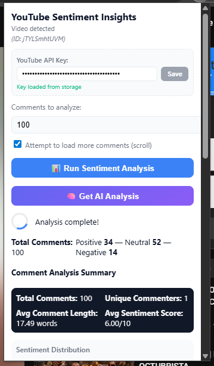
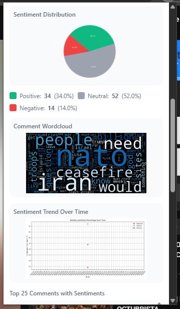
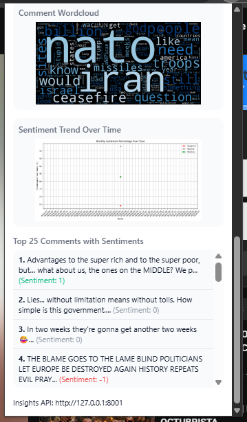
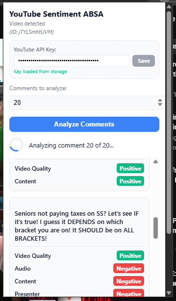
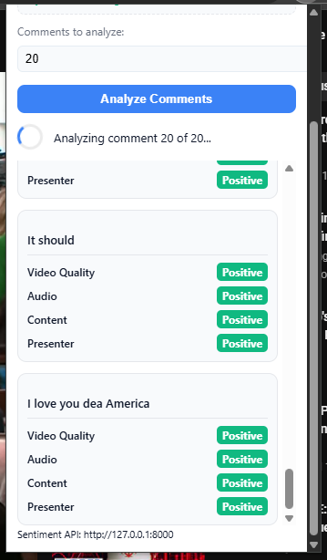
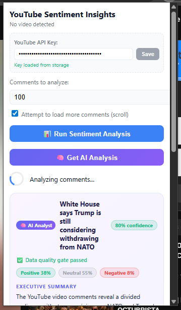
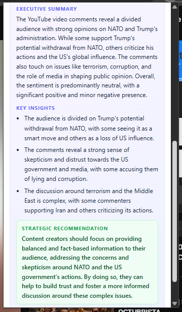

# 🎥 YouTube Sentiment Analysis — Hybrid Agentic MLOps System


An end-to-end **Hybrid Agentic MLOps System** that delivers real-time sentiment insights and AI-generated strategic analyses for YouTube content creators. This project integrates a `pydantic-ai` **Content Intelligence Analyst** agent on top of a production-grade 12-stage DVC pipeline, demonstrating a complete transition from manual MLOps to autonomous, self-orchestrating AI systems.

> [!NOTE]
> **Current Phase: v2.0 — Hybrid Agentic MLOps System.** The deterministic FTI pipeline (DVC + MLflow + Great Expectations) has been elevated with a probabilistic agentic layer (pydantic-ai + Gemini Flash), completing the Brain ↔ Brawn architecture. The system now delivers executive-grade `AnalystReport` narratives alongside traditional ML sentiment predictions.

---

## 🚀 Project Overview

This system allows content creators to instantly gauge audience reaction through two bespoke **Chrome Extensions**. Behind the scenes, a robust MLOps pipeline orchestrates data versioning, experiment tracking, and automated deployment — and an autonomous AI Agent synthesizes that data into actionable business narratives.

*   **Real-time Sentiment Analysis:** Process comments instantly: deterministic ML predictions (LightGBM/XGBoost) for speed, DistilBERT for granularity.
*   **Agentic AI Reports:** A `pydantic-ai` Content Intelligence Analyst fetches comments, validates data quality, runs ML inference, and synthesizes an executive `AnalystReport` — all autonomously.
*   **Self-Healing Fallback:** The Agent implements a multi-provider fallback (Gemini → Groq) with dynamic payload truncation (load shedding) to ensure service continuity under quota exhaustion.
*   **Production Grade:** Built with reproducibility, scalability, and CI/CD at its core. Zero training-serving skew.

## 📖 Project Design & Strategy

For a deep dive into the strategic and technical foundation of this project, refer to the following documentation:

| Document | Description |
| :--- | :--- |
| [**Project Charter**](./reports/docs/references/project_charter.md) | The "Why" and "What" — core foundation and strategy. |
| [**Product Requirements (PRD)**](./reports/docs/references/prd.md) | Comprehensive feature specs and success metrics. |
| [**Technical Roadmap**](./reports/docs/references/technical_roadmap.md) | Phase-by-phase implementation and hardening plan. |
| [**Agentic System Design**](./reports/docs/workflows/agentic_system.md) | Strategic assessment and implementation plan for the v2.0 agentic upgrade. |
| [**Framework Decision**](./reports/docs/decisions/agentic_framework.md) | Technology decision: pydantic-ai vs. LangChain, Gemini vs. Groq fallback. |
| [**Upgrade Report**](./reports/docs/evaluations/youtube_sentiment_upgrade.md) | Full changelog of the v1.4 → v2.0 system upgrade. |
| [**Codebase Review**](./reports/docs/evaluations/codebase_review.md) | Production readiness assessment — final score: **9.7 / 10**. |

---

### 📸 Extension Previews

#### 📊 Run Sentiment Analysis
<div align="center">
  
  
  
  <p><i>Standard Sentiment Analysis pipeline: pie charts, word clouds, and historical trend graphs.</i></p>
</div>

#### 🔍 Aspect-Based Sentiment Analysis (ABSA)
<div align="center">
  
  
  <p><i>Granular topic-level sentiment using a DeBERTa-based NLI model (Zero-Shot ABSA).</i></p>
</div>

#### 🧠 Get AI Analysis (Agentic Report)
<div align="center">
  
  
  <p><i>The Content Intelligence Analyst agent: executive summary, key insights, and strategic recommendations synthesized from ML results.</i></p>
</div>

---

## 🏗 System Architecture (v2.0)

The ecosystem operates across four synchronized layers:

```
Chrome Extension (popup.js)
    │  POST /v1/agent/analyze → AnalystReport JSON
    ▼
FastAPI Inference Service (src/api/main.py — Port 8000)
    ├── /v1/predict          ← Deterministic ML inference
    ├── /v1/agent/analyze    ← Agentic AI report
    └── Agent Router (src/api/agent_api.py)
         │
         ▼
Content Intelligence Analyst (Brain — pydantic-ai + Gemini Flash)
    │  Orchestrates tool calls. NEVER runs math or classification.
    │
    ├── YouTube API Tool       ← fetch_youtube_comments_tool()
    ├── Data Quality Tool      ← check_data_quality_tool()
    └── Sentiment Inference Tool ← analyze_sentiment_tool() → FastAPI /v1/predict
         │                          (Deterministic ML: LightGBM/XGBoost)
         ▼
AnalystReport (Pydantic schema — structured JSON to Chrome Extension)
```

1.  **🧠 Agentic Layer (v2.0):** `pydantic-ai` Agent orchestrates deterministic tools. The LLM only synthesizes narrative — never runs math.
2.  **⚙️ Inference Core:** FastAPI serves ML predictions + the Agent endpoint. Lazy-loaded models for fast startup.
3.  **📊 Data & Modeling:** 12-stage DVC DAG with MLflow tracking, Great Expectations data contracts, and automated champion selection.
4.  **🖥️ Presentation:** Chrome Extensions inject real-time insights directly into the YouTube UI.

---

## ✨ Key Features

| Feature | Description |
| :--- | :--- |
| **Content Intelligence Analyst** | A `pydantic-ai` agent that synthesizes ML results into executive `AnalystReport` JSON (v2.0). |
| **Self-Healing Fallback** | Automatic Gemini → Groq failover with dynamic payload truncation to handle provider quota errors. |
| **Dual-Model Strategy** | **LightGBM/XGBoost** for speed + **DistilBERT** for deep semantic granularity. |
| **Structural Data Contracts** | All Agent I/O enforced via Pydantic `extra="forbid"` models. Zero free-text leakage. |
| **Automated 12-Stage Pipeline** | Full DVC DAG from ingestion → data validation → feature engineering → HPO → evaluation → registry. |
| **Multi-Pillar Validation** | `validate_system.bat` script enforces code quality, data contracts, test coverage (50%+ gate), and service health. |
| **Backend Orchestrator** | `launch_extension_backend.bat` script manages MLflow, Main API (Port 8000), and Insights API (Port 8001) in one command. |
| **Great Expectations Validation** | Statistical data quality contracts (null thresholds, text length, label balance) enforced as a pipeline gate. |
| **Strict CI/CD** | GitHub Actions for Linting (`Ruff`), Type-checking (`Pyright`), Testing (70% coverage gate), and Docker builds. |
| **Zero Training-Serving Skew** | Unified preprocessing and feature engineering components shared between the DVC pipeline and FastAPI. |
| **MLflow Experiment Tracking** | Nested Parent/Child runs for HPO trials, champion selection, and automated model registration. |

---

## 🏃‍♂️ Usage Guide (Run Locally)

Follow these steps to get the full stack running on your machine.

### 1. Prerequisites
- Python 3.12+
- `uv` (Universal Package Manager)
- Docker (Optional, for containerized run)
- A Google Gemini API key (for the Agentic endpoint)
- A YouTube Data API v3 key (for the Chrome Extension / Agent)

### 2. Installation
```bash
# Clone the repo
git clone https://github.com/SebastianGarrido2790/Youtube-Sentiment-MLOPS.git
cd Youtube-Sentiment-MLOPS

# Install all dependencies (fast!)
uv sync

# Copy and configure environment variables
cp .env.example .env
# → Fill in GEMINI_API_KEY, YOUTUBE_API_KEY, MLFLOW_TRACKING_URI
```

### 3. Start Backend Services (The Easy Way)
Instead of manual terminal management, use the provided orchestration script to launch all services (MLflow, Sentiment API, and Insights API):

```bash
# Double-click or run from terminal
.\launch_extension_backend.bat
```
*This launches the Inference API on `8000`, the Insights API on `8001`, and MLflow on `5000`.*

### 4. Validate System Health
Ensure all architecture pillars (Code, Tests, DVC, and APIs) are operational:

```bash
# Run the multi-point health check
.\validate_system.bat
```

### 5. Test the Agent Endpoint
```bash
curl -X POST http://127.0.0.1:8000/v1/agent/analyze \
  -H "Content-Type: application/json" \
  -d '{"video_url": "https://youtube.com/watch?v=dQw4w9WgXcQ", "max_comments": 50}'
```

### 6. Setup Chrome Extensions

#### A. Create API Keys
- **YouTube Data API v3:** Go to [Google Cloud Console](https://console.cloud.google.com/) → APIs & Services → Enable **YouTube Data API v3** → Create an API Key.
- **Gemini API:** Go to [Google AI Studio](https://aistudio.google.com/app/apikey) → Create API Key. Add it to `.env` as `GEMINI_API_KEY`.

#### B. Load the Extensions in Chrome
1. Open Chrome and navigate to `chrome://extensions/`.
2. Toggle **Developer mode** (top right) **ON**.
3. **Standard Insights Extension:** Click **Load unpacked** → Select the `chrome-extension/` folder.
4. **ABSA Extension:** Click **Load unpacked** → Select the `chrome-extension-absa/` folder.

#### C. Use It!
1. Go to any YouTube video.
2. Click the extension icon.
3. Enter your **YouTube API Key** in the Settings section.
4. Click **📊 Run Sentiment Analysis** for the deterministic ML dashboard.
5. Click **🧠 Get AI Analysis** for the agentic executive report.

---

## 🐳 Docker Deployment

For a production-ready setup, use Docker Compose to spin up all services at once.

```bash
cd docker
docker-compose up --build -d
```
This launches:
- **Inference + Agent API** at `http://localhost:8000`
- **Insights API** at `http://localhost:8001`
- **MLflow** at `http://localhost:5000`

---

## 🛠 Tech Stack

| Component | Technology |
| :--- | :--- |
| **Language** | Python 3.12, JavaScript (Vanilla) |
| **Package Manager** | `uv` (Rust-based, extremely fast) |
| **AI Agent** | `pydantic-ai` (Content Intelligence Analyst) |
| **LLM Providers** | Google Gemini Flash (primary) + Groq LLaMA (fallback) |
| **Frameworks** | FastAPI, Pandas, Scikit-Learn, PyTorch, Transformers |
| **MLOps** | DVC (Data Versioning), MLflow (Experiments + Registry), Docker |
| **Data Quality** | Great Expectations (Statistical Data Contracts) |
| **CI/CD** | GitHub Actions (Test, Lint, Pyright, Security Scan) |
| **Cloud** | AWS (ECR, EC2, S3) |

---

## 📄 License

Distributed under the MIT License. See [LICENSE.txt](LICENSE.txt) for more information.

## 🤝 Contact

**Sebastian Garrido**
[LinkedIn](https://www.linkedin.com/in/sebastiangarrido) | [GitHub](https://github.com/SebastianGarrido2790)
