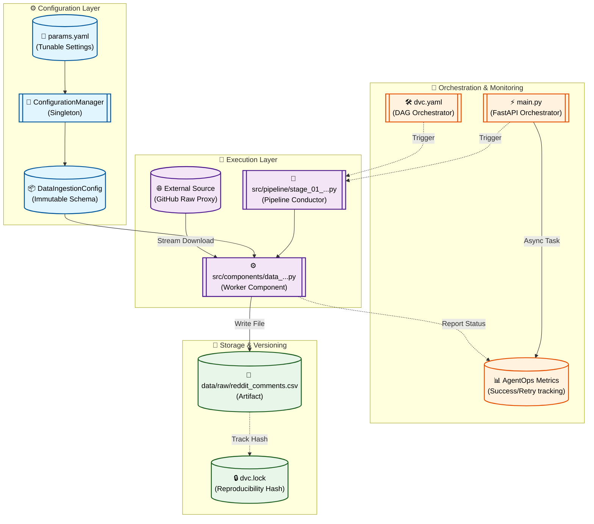

# Stage 01: Data Ingestion Anatomy

## 1. Executive Summary
The **Data Ingestion** stage (`src/pipeline/stage_01_data_ingestion.py`) is the entry point of the MLOps pipeline. Its sole responsibility is to securely fetch the raw dataset from an external source (acting as a proxy for a data lake) and persist it locally as an immutable artifact.

In the 2.0 architecture, this stage is decoupled into a **Pipeline Conductor** (the stage execution script) and a **Worker Component** (the business logic), ensuring clear separation of concerns.

By decoupling ingestion from processing, we ensure:
- **Immutability:** The raw data is preserved in its original state.
- **Reproducibility:** DVC tracks the exact version of the data downloaded via MD5 hashing.
- **Resilience:** Network failures are isolated and managed through the Orchestrator's retry logic.

---

## 2. Architectural Flow

The following diagram illustrates the hybrid orchestration of this stage, where either DVC or the FastAPI Orchestrator can trigger the execution.



---

## 3. Component Interaction

This stage utilizes three distinct layers to ensure robust execution:

### A. The Conductor (`src/pipeline/stage_01_data_ingestion.py`)
Acts as a thin wrapper designed for pipeline integration. It initializes the `ConfigurationManager`, retrieves the `DataIngestionConfig`, and instantiates the worker component. This separation allows the same logic to be called via CLI, DVC, or microservices.

### B. The Worker Component (`src/components/data_ingestion.py`)
Contains the actual "hands" of the operation. It handles directory creation, uses `requests` with streaming (to avoid memory bottlenecks), and implements specific HTTP error handling.

### C. AgentOps Monitoring
When triggered via the **FastAPI Orchestrator**, this stage is monitored for:
- **Tool Call Accuracy:** Incremented upon successful file save.
- **Retry Latency:** Tracked if network timeouts trigger the orchestrator's retry loops.
- **Agentic Healing:** If a transient download error occurs, the orchestrator automatically re-triggers the Conductor twice before failing the plan.

---

## 4. DVC and Configuration Setup

### `dvc.yaml` Stage Definition
DVC tracks the script, utilities, and parameters. If any change, it invalidates the `data/raw/reddit_comments.csv` output.

```yaml
stages:
  data_ingestion:
    cmd: python -m src.pipeline.stage_01_data_ingestion
    deps:
      - src/pipeline/stage_01_data_ingestion.py
      - src/utils/logger.py
      - src/constants/__init__.py
    params:
      - config/params.yaml:
        - data_ingestion.url
        - data_ingestion.output_path
    outs:
      - data/raw/reddit_comments.csv
```

### `params.yaml` Configuration
Centralized control of external resources without hardcoding.

```yaml
data_ingestion:
  url: "https://raw.githubusercontent.com/Himanshu-1703/reddit-sentiment-analysis/refs/heads/main/data/reddit.csv"
  output_path: "data/raw/reddit_comments.csv"
```

---

## 5. Why This is "Robust MLOps"

1.  **Strict Type Safety:**
    By using **Pydantic** schemas, configuration errors (e.g., malformed URLs) are caught before a single byte is downloaded.

2.  **Single Source of Truth:**
    Enforcement of `params.yaml` over CLI arguments ensures that DVC's lineage tracking is 100% accurate.

3.  **Hybrid Orchestration:**
    The stage is optimized for both **Batch production** (DVC) and **Real-time Agentic triggers** (FastAPI).

4.  **Resilient Streaming:**
    The use of chunked streaming (`iter_content`) ensures the component can handle datasets much larger than the available RAM, making it scalable for future data lake growth.
