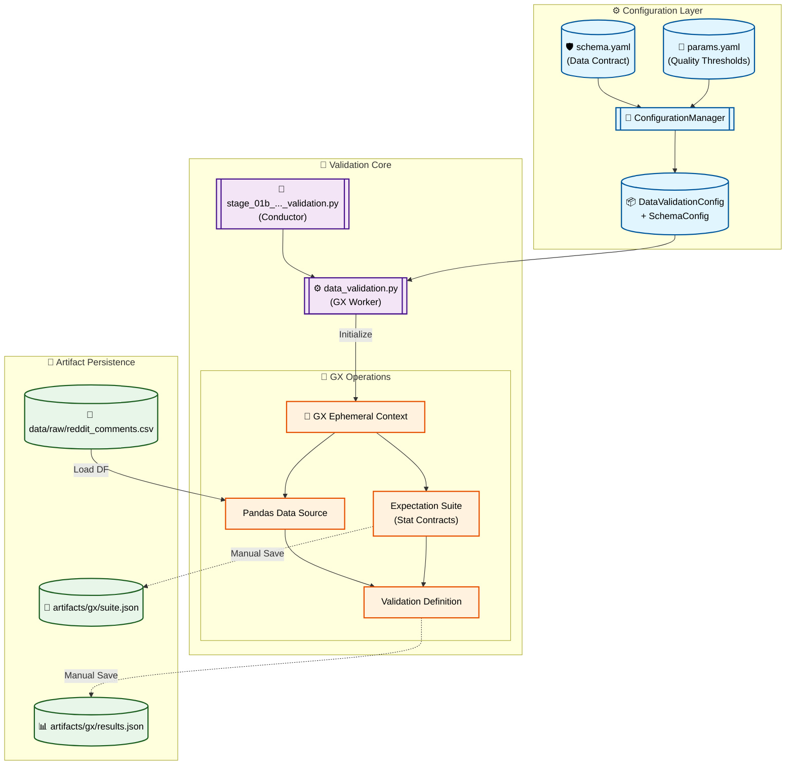

# Stage 01b: Data Validation Anatomy

## 1. Executive Summary
The **Data Validation** stage (`src/pipeline/stage_01b_data_validation.py`) acts as the project's quality firewall. It enforces statistical data quality contracts on the raw dataset before it enters the preparation and training pipelines. By leveraging **Great Expectations (GX)**, the system ensures that "garbage in" does not result in "garbage out."

This stage verifies column existence, null value ratios, text length constraints, and label set compliance, providing transparency and auditing for all ingested data.

---

## 2. Architectural Flow

The following Mermaid diagram illustrates how the validation stage integrates with the system's configuration and persistence layers.



---

## 3. Component Interaction

The validation stage relies on the **Conductor-Worker** pattern with a specialized dependency on the **Great Expectations (GX)** SDK.

### A. The Conductor (`src/pipeline/stage_01b_data_validation.py`)
Responsible for orchestrating the validation lifecycle. It fetches the required configurations (Paths, Thresholds, and Schema) from the `ConfigurationManager` and instantiates the `DataValidation` component.

### B. The Worker Component (`src/components/data_validation.py`)
Implements the statistical validation logic using **Great Expectations**.
- **Ephemeral Context:** Instead of requiring a pre-existing GX configuration directory, it initializes an in-memory ephemeral context for maximum flexibility.
- **Contract Enforcement:** It dynamically builds an `ExpectationSuite` based on the values in `schema.yaml` and the thresholds in `params.yaml`.

### C. The Data Contract (`schema.yaml`)
Acts as the **Single Source of Truth** for the dataset structure. It defines which columns *must* exist and their expected roles (features vs. target).

---

## 4. Key Expectations (The Contracts)

The system enforces four primary quality checks:
1.  **Column Existence:** Ensures all columns defined in the schema are present in the CSV.
2.  **Null Thresholds:** Uses `ExpectColumnValuesToNotBeNull(mostly=X)` where $X$ is derived from `params.yaml`.
3.  **Content Constraints:** Verifies that `clean_comment` string lengths fall within the $[min, max]$ range defined in parameters.
4.  **Domain Validity:** Ensures the `category` labels belong strictly to the set $\{-1, 0, 1\}$.

---

## 5. DVC and Configuration Setup

### `dvc.yaml` Stage Definition
DVC tracks the validation stage. If the raw data changes or the validation thresholds are adjusted, the validation results are invalidated.

```yaml
stages:
  data_validation:
    cmd: python -m src.pipeline.stage_01b_data_validation
    deps:
      - data/raw/reddit_comments.csv
      - src/pipeline/stage_01b_data_validation.py
      - src/components/data_validation.py
    params:
      - config/params.yaml:
        - data_validation.null_threshold_percent
        - data_validation.min_text_length
        - data_validation.max_text_length
    outs:
      - artifacts/gx/
```

### `params.yaml` Quality Thresholds
Tunable parameters that control the strictness of the "mostly" logic in GX.

```yaml
data_validation:
  null_threshold_percent: 5.0
  min_text_length: 2
  max_text_length: 5000
```

---

## 6. Why This is "Robust MLOps"

1.  **Auditable Artifacts:**
    Every validation run generates a serialized `validation_results.json` and `suite_name.json`. These are tracked by Git/DVC, providing a historical record of data quality over time.

2.  **Deterministic Logic:**
    By mapping `schema.yaml` directly to GX expectations, we eliminate "quality drift" in the codebase.

3.  **Fast Failing:**
    The pipeline is designed to check for empty datasets or missing files *before* attempting complex GX operations, saving compute time and providing clearer error messages.

4.  **Agentic Readiness:**
    The success/fail boolean returned by this stage is consumed by the **FastAPI Orchestrator**. If validation fails, the orchestrator can halt the training plan before wasting GPU/CPU resources on corrupted data.
