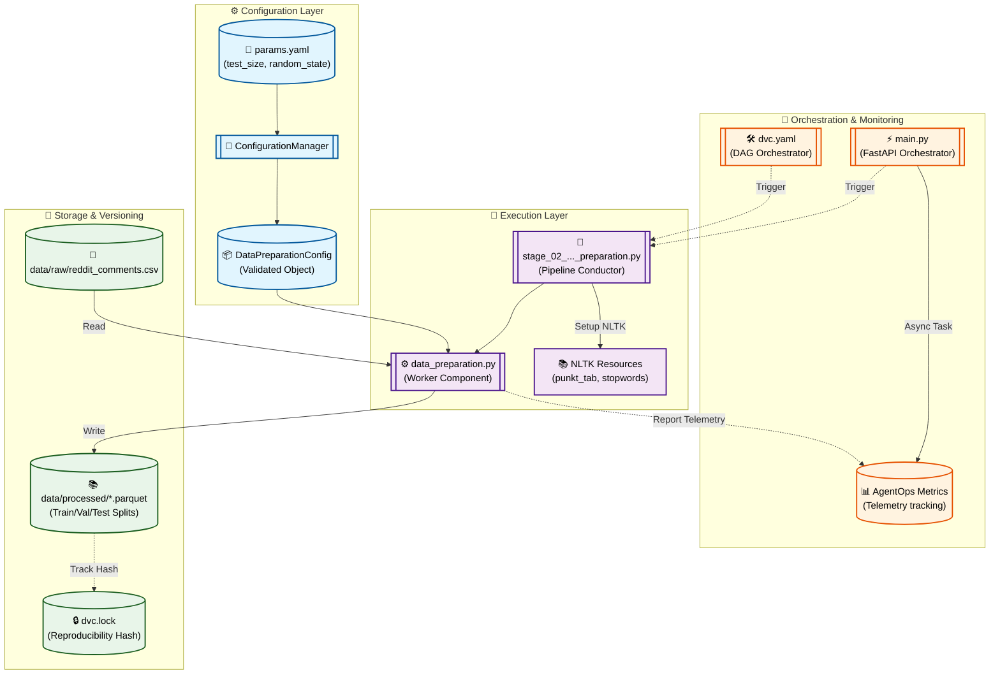

# Stage 02: Data Preparation Anatomy

## 1. Executive Summary
The **Data Preparation** stage (`src/pipeline/stage_02_data_preparation.py`) transforms raw, immutable data into cleaned, structured datasets optimized for training. It acts as the "refinery" of the FTI pipeline, handling text normalization, label encoding, and stratified splitting.

Key operations performed:
- **NLTK Lifecycle:** Automatic management of essential resources (`punkt_tab`, `stopwords`).
- **Cleaning:** Text normalization using lowercasing, strict regex filtering (`[^a-zA-Z\s]`), and stop-word removal.
- **Label Encoding:** Mapping raw labels `{-1, 0, 1}` to standardized non-negative integers `{0, 1, 2}` for model compatibility.
- **Stratified Splitting:** Partitioning data into **Train**, **Validation**, and **Test** sets while meticulously preserving class distribution.
- **Persistence:** Serializing data splits as **Parquet** files to preserve schema and improve I/O performance.

---

## 2. Architectural Flow

The following diagram illustrates the hybrid orchestration of the preparation stage, emphasizing the transition from dirty raw data to clean modeling snapshots.



---

## 3. Component Interaction

This stage follows the **Conductor-Worker** pattern to separate environment setup from core logic.

### A. The Conductor (`src/pipeline/stage_02_data_preparation.py`)
Responsible for environmental readiness. It ensures that NLTK resources are fetched quietly and that the `data/processed` directory structure exists before triggering the worker.

### B. The Worker Component (`src/components/data_preparation.py`)
Executes the dataset transformations:
- **Regex Normalization:** Strips special characters and redundant whitespace.
- **Stratified Partitioning:** Uses `sklearn.model_selection.train_test_split` twice to achieve specific $Train/Val/Test$ ratios while maintaining class balance.
- **Parquet Pipeline:** Converts Pandas DataFrames to the columnar Parquet format, ensuring zero type-loss between stages.

### C. AgentOps Monitoring
When orchestrated via FastAPI, the stage provides:
- **Success Rate Tracking:** Logged upon successful creation of all three Parquet splits.
- **Data Distribution Telemetry:** Original vs. Encoded label distributions are captured in logs for auditing.

---

## 4. DVC and Configuration Setup

### `dvc.yaml` Stage Definition
Tracks the raw input, the preparation script, and all cleaning parameters to construct the DAG.

```yaml
stages:
  data_preparation:
    cmd: python -m src.pipeline.stage_02_data_preparation
    deps:
      - data/raw/reddit_comments.csv
      - src/pipeline/stage_02_data_preparation.py
      - src/components/data_preparation.py
      - src/utils/logger.py
    params:
      - config/params.yaml:
        - data_preparation.test_size
        - data_preparation.random_state
    outs:
      - data/processed/train.parquet
      - data/processed/val.parquet
      - data/processed/test.parquet
```

### `params.yaml` Configuration
Tunable hyperparameters that control the split physics.

```yaml
data_preparation:
  test_size: 0.15
  random_state: 42
```

---

## 5. Why This is "Robust MLOps"

1.  **Strict Type Safety:**
    `test_size` and `random_state` are validated at runtime via Pydantic, preventing "poisoned" split logic from corrupting experiments.

2.  **Zero Information Leakage:**
    By using `stratify=df["category"]`, we ensure that the model is trained and evaluated on balanced class distributions, preventing skewed metric reporting.

3.  **Parquet vs. CSV:**
    The choice of **Parquet** over CSV guarantees that integers stay integers and strings stay strings. This eliminates the "floating-point category" bug common in CSV-based pipelines.

4.  **Self-Healing Setup:**
    The conductor's `nltk.download` logic ensures that the stage is "Cloud Native" and can run in any fresh container environment without manual setup.
