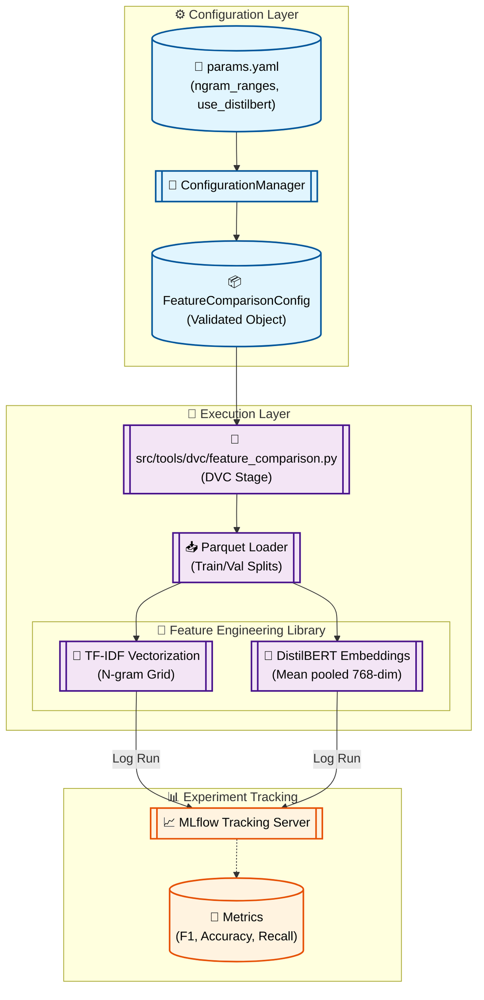

# Stage 03: Feature Comparison Anatomy

## 1. Executive Summary
The **Feature Comparison** stage (`src/tools/dvc/feature_comparison.py`) is a research-oriented study designed to evaluate different text representation strategies. It compares traditional **TF-IDF** n-grams against context-aware **DistilBERT** embeddings to determine the most effective feature engineering path for sentiment classification.

Crucially, this stage is **transient**: it does not produce versioned artifacts (like Parquet files) for downstream consumption. Its primary output is **metadata** logged to **MLflow**, allowing data scientists to make quantitative decisions during the research phase without polluting the main production DAG with experimental artifacts.

---

## 2. Architectural Flow

The following diagram illustrates the hybrid layout, where DVC manages the execution dependency while MLflow captures the experimental metrics.



---

## 3. Component Interaction

### A. The Study Tool (`src/tools/dvc/feature_comparison.py`)
A standalone Python module designed to be executed via `python -m`. It encapsulates the entire experimental loop, from embedding generation to baseline training and metric logging.

### B. Feature Libraries
- **TF-IDF Engine:** Uses `TfidfVectorizer` to explore multiple n-gram ranges (e.g., `(1,1)`, `(1,2)`) and vocabulary sizes.
- **DistilBERT Engine:** Uses Hugging Face `transformers` and `PyTorch` to generate dense embeddings. It includes a "GPU Guard" that skips execution if CUDA is unavailable, preventing slow CPU inference from blocking the pipeline.

### C. MLflow Studio
Every iteration of the study (e.g., "TFIDF 1-2gram") is logged as a separate run. This enables the team to use the MLflow UI to compare **Precision-Recall curves** and **Confusion Matrices** side-by-side.

---

## 4. DVC and Configuration Setup

### `dvc.yaml` Stage Definition
Note that the stage depends on the processed data but defines no `outs`. This keeps the production DAG clean.

```yaml
  feature_comparison:
    cmd: python -m src.tools.dvc.feature_comparison
    deps:
      - artifacts/data/processed/train.parquet
      - artifacts/data/processed/val.parquet
      - src/tools/dvc/feature_comparison.py
      - src/utils/feature_utils.py
    params:
      - config/params.yaml:
        - feature_comparison.ngram_ranges
        - feature_comparison.max_features
        - feature_comparison.use_distilbert
```

### `params.yaml` Grid Definition
Controls the search space for the comparison study.

```yaml
feature_comparison:
  ngram_ranges: [[1, 1], [1, 2]]
  max_features: 5000
  use_distilbert: false # Toggle for expensive DL inference
  batch_size: 32
```

---

## 5. Why This is "Robust MLOps"

1.  **Transient Data Studies:**
    By separating "Discovery" (Feature Comparison) from "Production" (Feature Engineering), we avoid creating a DAG where every experimental change invalidates the entire training pipeline.

2.  **GPU-Awareness:**
    The implementation includes conditional logic to detect hardware capability, ensuring that expensive transformer inference only runs on compatible environments.

3.  **Strict Contract Validation:**
    Parameters like `ngram_ranges` (list of lists) are validated by **Pydantic** before execution, ensuring that malformed experimental grids are caught immediately.

4.  **No Artifact Pollution:**
    Only the *results* of the research are preserved in MLflow. This minimizes storage costs and prevents the creation of hundreds of "orphaned" experimental data files.
