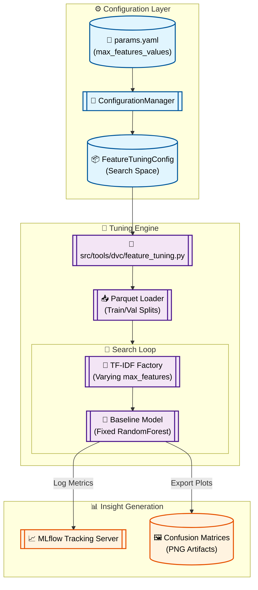

# Stage 04: TF-IDF Max Features Tuning Anatomy

## 1. Executive Summary
The **Feature Tuning** stage (`src/tools/dvc/feature_tuning.py`) performs a targeted search for the optimal TF-IDF vocabulary size. Building on the insights from Stage 03 (Feature Comparison), where the optimal N-gram range was selected, this stage iterates through a grid of `max_features` candidates to find the inflection point where performance gains plateau relative to model complexity.

This is an **iterative transient** stage. It produces no modeling artifacts but generates critical visualization reports (`reports/figures/tfidf_max_features/`) and logs a full telemetry stream to **MLflow**, enabling the selection of the production-grade `best_max_features` parameter.

---

## 2. Architectural Flow

The following diagram illustrates the tuning cycle, which narrows the focus from broad feature studies to specific vocabulary optimization.



---

## 3. Component Interaction

### A. The Tuning Conductor (`src/tools/dvc/feature_tuning.py`)
Acts as a loop-driven experiment orchestrator. It retrieves the `best_ngram_range` (selected from Stage 03) and applies it as a constant while varying the vocabulary size. This isolated variable approach ensures the resulting performance changes are attributable purely to feature density.

### B. The Factory Logic
- **TfidfVectorizer:** Re-instantiated in every loop. It uses `min_df=2` to filter out rare tokens and `stop_words="english"` to reduce noise.
- **RandomForest Benchmarker:** A fixed configuration of 200 trees (`n_estimators`) is used as a consistent "yardstick" for all candidates in the list.

### C. Visual Evidence
Unlike Stage 03, this stage exports physical PNG artifacts to `reports/figures/tfidf_max_features/`. These plots provide a visual audit of how the model's confusion matrix evolves as we increase the feature count.

---

## 4. DVC and Configuration Setup

### `dvc.yaml` Stage Definition
Tracks the grid of candidate values. DVC only re-runs the tuning if the dataset or the search grid changes.

```yaml
  feature_tuning:
    cmd: python -m src.tools.dvc.feature_tuning
    deps:
      - artifacts/data/processed/train.parquet
      - artifacts/data/processed/val.parquet
      - src/tools/dvc/feature_tuning.py
      - src/utils/feature_utils.py
    params:
      - config/params.yaml:
        - feature_tuning.max_features_values
        - feature_tuning.best_ngram_range
    outs:
      - reports/figures/tfidf_max_features/
```

### `params.yaml` Grid Configuration
Codifies the search space as a native YAML list, ensuring strict versioning of the experiment logic.

```yaml
feature_tuning:
  max_features_values:
    - 1000
    - 3000
    - 5000
    - 7000
    - 9000
  best_ngram_range: [1, 2] # Carried over from Comparison Study
  n_estimators: 200
  max_depth: 15
```

---

## 5. MLOps Design Principles

1.  **Iterative Refinement (Rule 2.1):**
    By freezing the `best_ngram_range`, this stage follows the scientific method of isolating a single variable (`max_features`) for optimization, reducing noise in the results.

2.  **Scalability Analysis:**
    The grid loop allows the team to observe the "curse of dimensionality" in real-time. If performance peaks at 5000 features and oscillates at 9000, we choose 5000 to minimize model size and latency.

3.  **Strict Contract Validation:**
    `FeatureTuningConfig` uses Pydantic to enforce that `max_features_values` is a list of integers, preventing a malformed string or float from causing a mid-loop crash.

4.  **Evidence-Based Decisions:**
    The export of Confusion Matrices to `reports/` ensures that the final selection of `best_max_features` is documented with visual proof for stakeholders.
