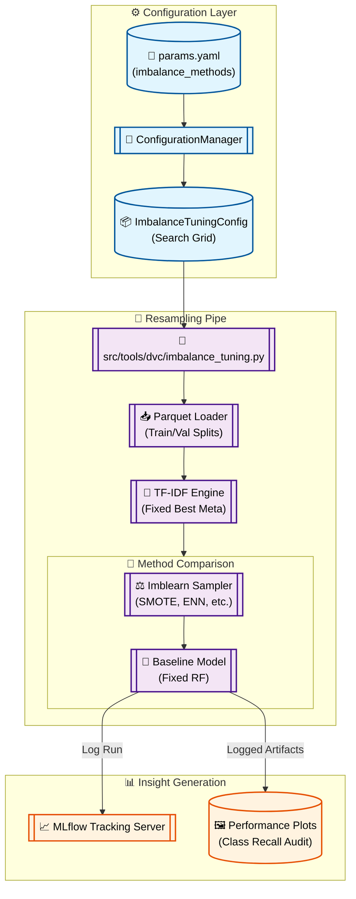

# Stage 05: Imbalance Handling Tuning Anatomy

## 1. Executive Summary
The **Imbalance Tuning** stage (`src/tools/dvc/imbalance_tuning.py`) evaluates various strategies to address class imbalance inherent in sentiment datasets (where positive samples often outnumber neutral/negative ones). The goal is to maximize minority class recall and overall F1-score without sacrificing general accuracy.

Building on the optimized feature set from Stages 03 and 04, this stage leverages the `imblearn` library to apply techniques like **SMOTE**, **ADASYN**, and **SMOTE+ENN** to the training feature matrices. By fixing the vectorization parameters, this stage isolates the effect of resampling on model performance.

---

## 2. Architectural Flow

The following diagram illustrates the imbalance study flow, which operates purely on sparse feature matrices.



---

## 3. Component Interaction

### A. The Tuning Conductor (`src/tools/dvc/imbalance_tuning.py`)
Acts as a multi-strategy experiment runner. It fetches `best_max_features` and `best_ngram_range` from the configuration and applies them to generate the base training matrix. It then iterates through the `imbalance_methods` list defined in `params.yaml`.

### B. Resampling Library (`imblearn`)
The system integrates several advanced sampling strategies:
- **SMOTE:** Synthetic Minority Over-sampling.
- **ADASYN:** Adaptive Synthetic sampling for difficult-to-learn boundaries.
- **SMOTE+ENN:** A hybrid approach that over-samples the minority class and then uses Edited Nearest Neighbours to clean up messy boundaries.
- **Class Weights:** A deterministic alternative that adjusts the model's loss function instead of the data itself.

### C. Evaluation Framework
The stage uses the `evaluate_and_log` utility to generate class-specific metrics. This is critical for imbalance studies, as overall accuracy can be misleading. We focus on the **F1-macro** and **Minority Class Recall**.

---

## 4. DVC and Configuration Setup

### `dvc.yaml` Stage Definition
Tracks the study logic and the grid of imbalance methods.

```yaml
  imbalance_tuning:
    cmd: python -m src.tools.dvc.imbalance_tuning
    deps:
      - artifacts/data/processed/train.parquet
      - artifacts/data/processed/val.parquet
      - src/tools/dvc/imbalance_tuning.py
      - src/utils/feature_utils.py
    params:
      - config/params.yaml:
        - imbalance_tuning.imbalance_methods
        - imbalance_tuning.best_max_features
        - imbalance_tuning.best_ngram_range
    outs:
      - reports/figures/imbalance_methods/
```

### `params.yaml` Configuration
Defines the list of resampling strategies to evaluate.

```yaml
imbalance_tuning:
  imbalance_methods:
    - class_weights
    - oversampling
    - adasyn
    - smote_enn
  best_max_features: 5000
  best_ngram_range: [1, 2]
  rf_n_estimators: 200
```

---

## 5. MLOps Design Principles

1.  **Leakage Prevention (Rule 2.1):**
    Resampling is strictly applied **only to the training set**. The validation set remains natively imbalanced, reflecting the true distribution the model will encounter in production.

2.  **Isolated Optimization:**
    By fixing Feature Extraction (Stages 3/4) and Model Architecture, this stage isolates "Imbalance Response" as the only independent variable.

3.  **Scientific Auditing:**
    Results are logged to a dedicated MLflow experiment ("Exp - Imbalance Handling"), allowing stakeholders to visualize the trade-off between sensitivity (Recall) and precision across all minority classes.

4.  **Reproducible Seeds:**
    Consistency is maintained across all samplers (SMOTE, etc.) using `random_state: 42`, ensuring that `dvc repro` generates identical synthetic points every time.
