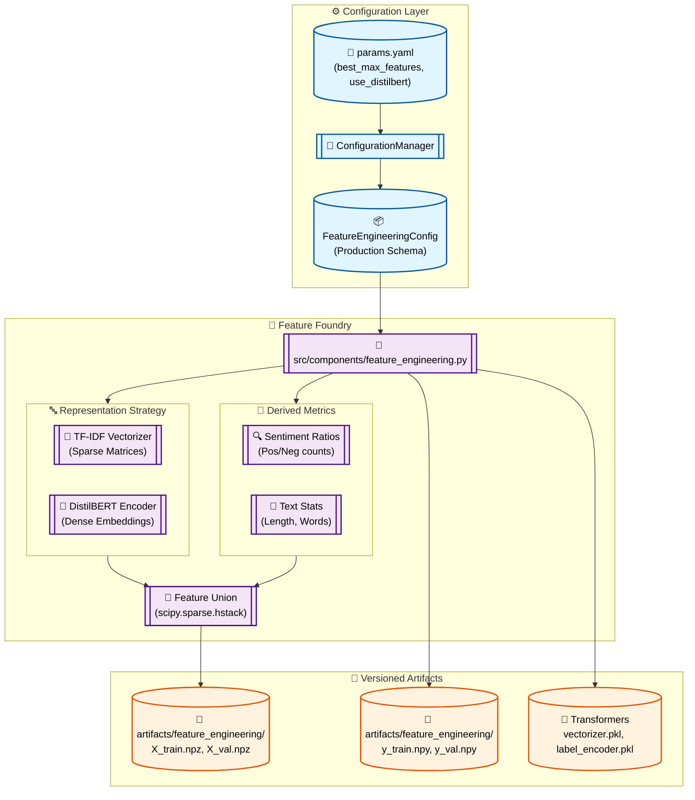

# Stage 06: Feature Engineering Anatomy

## 1. Executive Summary
The **Feature Engineering** stage (`src/components/feature_engineering.py`) is the transition point from raw text to high-fidelity numerical representations. It consolidates the research from Stages 03, 04, and 05 into a definitive production logic that generates the feature matrices ($X$) and label arrays ($y$) consumed by the training pipeline.

This stage implements a **Hybrid Feature Library**, combining tradition TF-IDF vectors with domain-specific derived metrics (lexicon ratios, text length). It is designed to be strategy-agnostic, supporting either sparse frequency vectors or dense DistilBERT embeddings via a simple configuration toggle.

---

## 2. Architectural Flow

The following diagram illustrates the transformation logic and the resulting versioned artifacts.



---

## 3. Component Interaction

### A. The Orchestration Logic (`src/pipeline/stage_03_feature_engineering.py`)
Acts as the **Conductor**, initializing the directory structures and invoking the component. It ensures that the `artifacts/feature_engineering/` path is prepared before execution.

### B. The Transformation Foundry (`src/components/feature_engineering.py`)
- **Strategy Toggle:** Uses `use_distilbert` from params to decide between sparse and dense pipelines.
- **Derived Features:** Calculates `char_len`, `word_len`, and lexicon ratios (e.g., `pos_ratio`, `neg_ratio`) using targeted keyword analysis.
- **Feature Union:** Combines the text representation with derived metrics using `hstack([X_text, X_derived])`. This creates a multi-modal feature space that captures both semantic context and structural signals.

### C. The Artifact Factory
- **X Matrices:** Saved as `.npz` using `Compressed Sparse Row (CSR)` format. This preserves the memory efficiency of TF-IDF vectors.
- **Y Vectors:** Saved as `.npy` NumPy binary files for lightning-fast loading.
- **Object Serialization:** Pickles the `TfidfVectorizer` and `LabelEncoder` so they can be re-used identically during real-time inference.

---

## 4. DVC Pipeline Setup

### `dvc.yaml` Stage Definition
Tracks the processed splits and the production configuration.

```yaml
  feature_engineering:
    cmd: python src/pipeline/stage_03_feature_engineering.py
    deps:
      - artifacts/data/processed/train.parquet
      - artifacts/data/processed/val.parquet
      - artifacts/data/processed/test.parquet
      - src/pipeline/stage_03_feature_engineering.py
      - src/components/feature_engineering.py
    params:
      - config/params.yaml:
        - feature_engineering.use_distilbert
        - imbalance_tuning.best_max_features
        - imbalance_tuning.best_ngram_range
    outs:
      - artifacts/feature_engineering/
```

---

## 5. MLOps Best Practices

1.  **Deterministic Mapping (Rule 1.14):**
    The `LabelEncoder` is fit on the training data and saved. This guarantees that `positive` always maps to `2` (or the equivalent integer) consistently from training through to the FastAPI inference endpoint.

2.  **No Training-Serving Skew:**
    By pickling the `vectorizer.pkl`, we ensure that the vocabulary used to "score" new YouTube comments in the Chrome extension is mathematically identical to the one the model was trained on.

3.  **Preventing Information Leakage:**
    Vectorizers are **fit solely on the Training split**. The Validation and Test splits are strictly `transformed`, ensuring that no out-of-fold vocabulary or distribution statistics influence the feature engineering.

4.  **Memory Optimization:**
    The use of `scipy.sparse.hstack` and `.npz` storage ensures that large YouTube datasets can be processed on commodity hardware without exhausting RAM.
