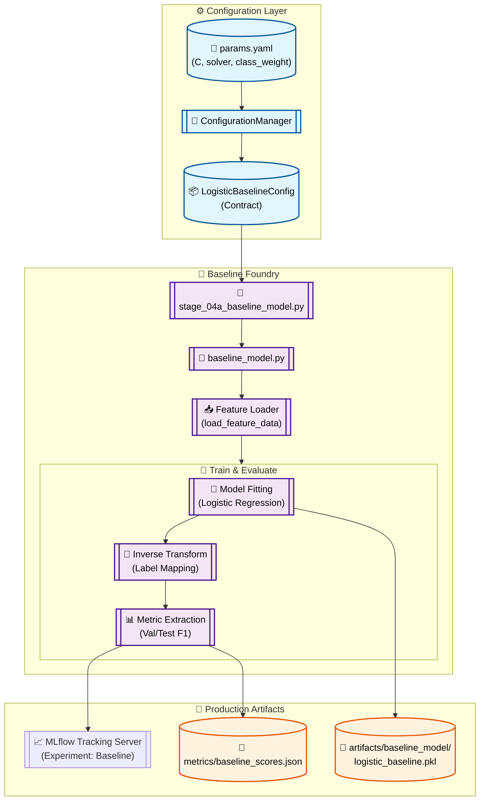

# Stage 07: Logistic Regression Baseline Anatomy

## 1. Executive Summary
The **Baseline Model** stage (`src/components/baseline_model.py`) trains a simple, high-interpretability Logistic Regression model on the definitive feature set. This serves as the primary performance benchmark ("The Floor") for the system, allowing for a quantitative evaluation of whether more complex architectures (LightGBM, DistilBERT) deliver sufficient ROI to justify their additional latency/compute costs.

This stage implements the **Model Bundle** pattern, where the estimator and the `LabelEncoder` are serialized together. This ensures that the inference layer always has access to the correct class mapping for real-world YouTube sentiment interpretation.

---

## 2. Architectural Flow

The following diagram illustrates the transition from engineered features to a versioned model artifact.



---

## 3. Component Interaction

### A. The Conductor (`src/pipeline/stage_04a_baseline_model.py`)
Acts as the pipeline entry point. It initializes the `BASELINE_MODEL_DIR`, retrieves the configuration object via `ConfigurationManager`, and executes the `train_baseline()` routine.

### B. The Feature Loader (`load_feature_data`)
A centralized utility that retrieves the sparse matrices (`X_train.npz`, etc.) and the target vectors from the `artifacts/feature_engineering` directory. Crucially, it also loads the `label_encoder.pkl` to preserve categorical context.

### C. The Logistic Benchmark
- **Imbalance Mitigation:** Defaults to `class_weight="balanced"`, adjusting the loss function to account for skewed YouTube sentiment labels.
- **Model Bundle:** The model is not saved in isolation. The `save_model_bundle` utility creates a dictionary `{"model": clf, "encoder": le}`, ensuring the serving layer is entirely self-sufficient.

---

## 4. DVC Pipeline Setup

### `dvc.yaml` Stage Definition
Tracks the finalized features and the model training logic.

```yaml
  baseline_model:
    cmd: python src/pipeline/stage_04a_baseline_model.py
    deps:
      - artifacts/feature_engineering/X_train.npz
      - artifacts/feature_engineering/y_train.npy
      - src/pipeline/stage_04a_baseline_model.py
      - src/components/baseline_model.py
    params:
      - config/params.yaml:
        - train.logistic_baseline.C
        - train.logistic_baseline.solver
        - train.logistic_baseline.class_weight
    outs:
      - artifacts/baseline_model/
    metrics:
      - artifacts/baseline_model/baseline_metrics.json:
          cache: false
```

---

## 5. MLOps Design Principles

1.  **Label Context Preservation:**
    By using the `LabelEncoder` during evaluation, the implementation logs class-specific metrics (e.g., `test_f1_Positive`) directly to MLflow. This provides a human-readable performance audit instead of ambiguous integer scores.

2.  **Experiment Traceability:**
    Every baseline run is tagged with `experiment_type: baseline_modeling`. This allows for cross-run comparisons against more complex models using the MLflow search interface.

3.  **Strict Hyperparameter Management:**
    No hardcoded parameters exist in the worker. The `C`, `solver`, and `max_iter` values are solely driven by the `params.yaml` file, ensuring that a simple configuration change can trigger a full pipeline re-run via DVC.

4.  **Metric Visibility:**
    The `baseline_metrics.json` is exported specifically for DVC to provide a quick "git-diffable" view of model performance changes over time across different git commits.
