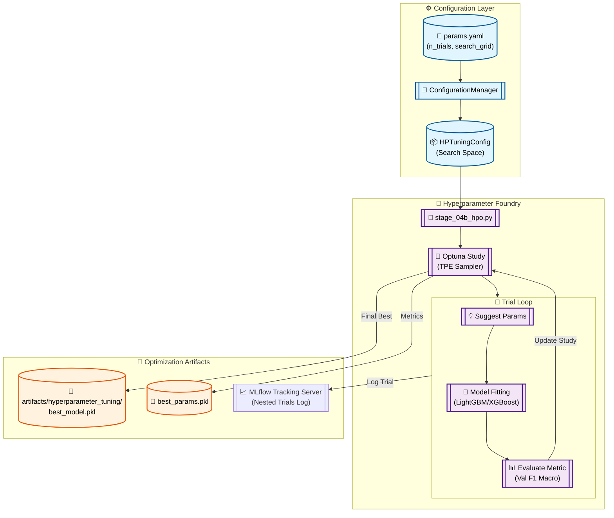

# Stage 08: Hyperparameter Tuning Anatomy

## 1. Executive Summary
The **Hyperparameter Tuning** stage (`src/components/hyperparameter_tuning.py`) utilizes the **Optuna** framework to optimize advanced gradient boosting models (LightGBM and XGBoost). This stage systematically explores the hyperparameter space to identify the configuration that maximizes the Macro F1-score on the validation set.

This is a **Transient Search** stage. While many models are trained during the optimization trials, only the "Champion" configuration is persisted. The stage culminates in a final **Retraining Cycle** using the best parameters, ensuring the saved model artifact is clean, reproducible, and ready for production serving.

---

## 2. Architectural Flow

The following diagram illustrates the optimization loop and the transition to a production-grade champion model.



---

## 3. Component Interaction

### A. The HPO Conductor (`src/pipeline/stage_04b_hyperparameter_tuning.py`)
Parses the CLI arguments to decide which model flavor (LightGBM or XGBoost) to tune. It then initializes the `HyperparameterTuning` component with the corresponding search grid from `params.yaml`.

### B. The Objective Function
The component implements a custom `objective(trial)` function that:
1.  **Suggests:** Retrieves numeric suggestions for parameters like `learning_rate`, `num_leaves`, and `feature_fraction`.
2.  **Evaluates:** Trains the candidate model on the sparse training matrix and returns the **Validation F1-Macro**.
3.  **Logs:** Every trial is automatically wrapped in an MLflow nested run, capturing the parameter-performance relationship in real-time.

### C. Champion Retraining
After the search trials complete (governed by `n_trials`), the system performs a final fit using the discovered optimal parameters. This step ensures that:
- The model is trained on the standard `X_train` without the overhead of the Optuna sampler wrapper.
- The `LabelEncoder` context is correctly bundled with the final estimator.

---

## 4. DVC Pipeline Setup

### `dvc.yaml` Stage Definition
Tracks the search logic and the resulting best model artifact.

```yaml
  hyperparameter_tuning:
    cmd: python src/pipeline/stage_04b_hyperparameter_tuning.py --model lightgbm
    deps:
      - artifacts/feature_engineering/X_train.npz
      - src/pipeline/stage_04b_hyperparameter_tuning.py
      - src/components/hyperparameter_tuning.py
    params:
      - config/params.yaml:
        - train.hyperparameter_tuning.lightgbm.n_trials
        - train.hyperparameter_tuning.lightgbm.search_space
    outs:
      - artifacts/hyperparameter_tuning/
```

---

## 5. MLOps Design Principles

1.  **Search Strategy:**
    The use of the **TPE (Tree-structured Parzen Estimator)** sampler instead of a Random or Grid search ensures that the optimization process learns from previous trials, converging on the best parameters faster and at a lower token/compute cost.

2.  **Telemetry Tiering:**
    The implementation uses MLflow's **Nested Runs** pattern. Trial results are nested under the main "Study" run. This prevents the primary dashboard from being cluttered by hundreds of experimental trial runs while still allowing for deep-dive coordinate analysis.

3.  **Graceful Pruning:**
    Large-scale tuning runs implement the `OptunaPruningCallback`, which stops trials that are clearly underperforming compared to established baselines, saving significant compute time.

4.  **Production-Ready Bundle:**
    The final artifact is an **Atomic Bundle** (`best_model.pkl`) containing the estimator, the encoder, and the metadata of the training split, ensuring zero friction when promoting the model to the registry.
