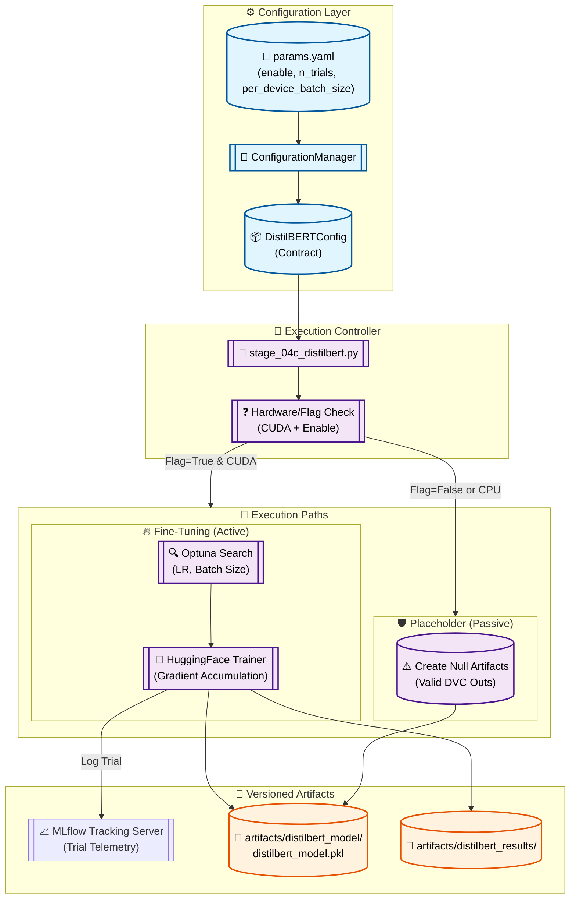

# Stage 09: DistilBERT Fine-Tuning Anatomy

## 1. Executive Summary
The **DistilBERT Fine-Tuning** stage (`src/components/distilbert_training.py`) implements the deep learning component of the sentiment Analysis system. It fine-tunes a pre-trained `distilbert-base-uncased` model for sequence classification, providing a high-capacity alternative to traditional TF-IDF/Gradient Boosting pipelines.

Given the high compute cost of transformer training, this stage implements **Conditional Execution** and **Self-Healing Placeholder** logic. If the local system lacks a CUDA-enabled GPU or if training is explicitly disabled in `params.yaml`, the component generates transient placeholder artifacts to ensure the DVC Directed Acyclic Graph (DAG) remains functionally valid without crashing downstream evaluation steps.

---

## 2. Architectural Flow

The following diagram illustrates the fine-tuning logic, including the fallback mechanism for CPU-only environments.



---

## 3. Component Interaction

### A. The DL Conductor (`src/pipeline/stage_04c_distilbert_training.py`)
Acts as the pipeline's "Smart Gatekeeper." It determines if the environment satisfies the prerequisites for deep learning (GPU and Flag) and invokes either the full training suite or the placeholder generator.

### B. The HF Trainer Engine (`src/components/distilbert_training.py`)
Utilizes the Hugging Face `Trainer` API to manage the training loop overhead:
- **Optimization:** Integrates **Optuna** to tune `learning_rate` and `weight_decay`.
- **Compute Efficiency:** Implements `gradient_accumulation_steps` to simulate larger batch sizes on consumer-grade VRAM.
- **Evaluation:** Uses `load_metric("f1")` to provide real-time validation accuracy and F1 scores during the training process.

### C. Self-Healing Placeholder Logic
To prevent "File Not Found" errors in the DVC DAG when training is skipped:
- It creates an **Atomic Model Bundle** containing a `None` model and the existing `LabelEncoder`.
- It writes a simplified `distilbert_metrics.json` with null values.
This architectural choice allows the `model_evaluation` stage to run comparisons between Logistic Regression and LightGBM without crashing when DistilBERT is unavailable.

---

## 4. DVC Pipeline Setup

### `dvc.yaml` Stage Definition
Tracks the raw text data (needed for tokenization) and the training logic.

```yaml
  distilbert_training:
    cmd: python src/pipeline/stage_04c_distilbert_training.py
    deps:
      - artifacts/data/processed/train.parquet
      - artifacts/data/processed/val.parquet
      - src/pipeline/stage_04c_distilbert_training.py
      - src/components/distilbert_training.py
    params:
      - config/params.yaml:
        - train.distilbert.enable
        - train.distilbert.n_trials
    outs:
      - artifacts/distilbert_model/
```

---

## 5. MLOps Design Principles

1.  **Heterogeneous Hardware Readiness:**
    The design acknowledges that developer machines (CPU-only) and CI/CD runners (GPU-enabled) have different capabilities. The pipeline adaptively handles these differences without code modification.

2.  **Gradient Checkpointing:**
    When active, the implementation supports gradient checkpointing to allow fine-tuning of the 66M-parameter model on hardware with as little as 4GB of VRAM.

3.  **Strict Serialization Contract:**
    Whether the path is "Active" or "Passive," the output directory structure is identical. This ensures that the FastAPI inference service doesn't require complex conditional loading logic—it simply checks for the presence of the model inside the bundle.

4.  **Telemetry Tiering:**
    Like Stage 08, DistilBERT trials are logged as **Nested Runs** in MLflow, ensuring performance comparisons across different transformer configurations are auditable.
