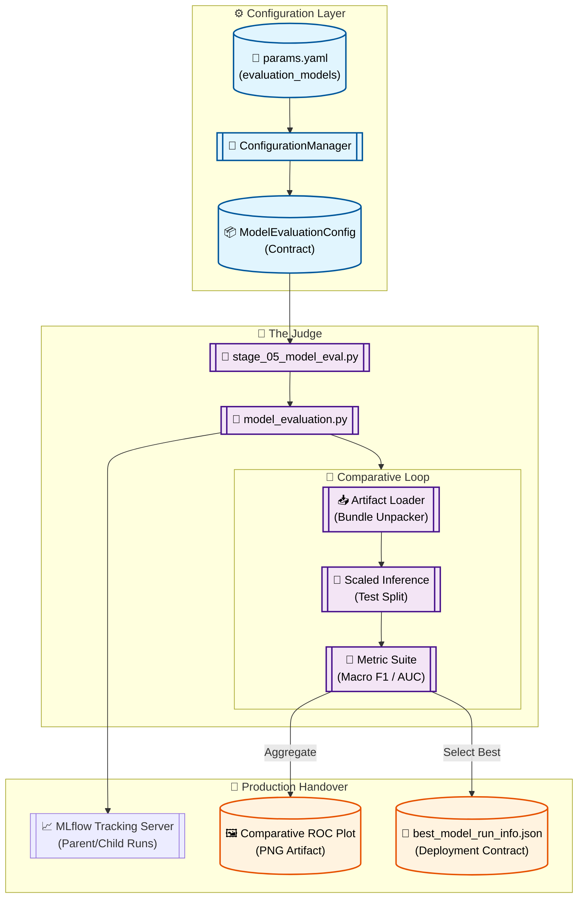

# Stage 10: Comparative Model Evaluation Anatomy

## 1. Executive Summary
The **Model Evaluation** stage (`src/components/model_evaluation.py`) determines the best-performing model for production. It executes a strictly unbiased comparison of all trained candidate models (Baseline, LightGBM, XGBoost, and DistilBERT) on the held-out **Test Set**—the data split that was isolated during Stage 02 and never utilized for training or hyperparameter tuning.

This stage acts as the **System Judge**. It generates a definitive performance scoreboard, produces comparative visualizations (ROC Curves), and outputs a critical **Handover Contract** (`best_model_run_info.json`) that specifies which champion model should be promoted to the production registry.

---

## 2. Architectural Flow

The following diagram illustrates the comparative logic and the generation of downstream deployment triggers.



---

## 3. Component Interaction

### A. The Evaluation Conductor (`src/pipeline/stage_05_model_evaluation.py`)
Acts as the global coordinator. It retrieves the list of target models from the configuration and sequentializes the evaluation of each candidate. It also handles the hardware-agnostic logic for DistilBERT, ensuring that if a "Null Bundle" is detected, the study continues without interruption.

### B. Polymorphic Model Loading
The system abstracts the complexity of different model types:
- **Logistic/GBM Bundles:** Unpacks the estimator and `LabelEncoder` from the `.pkl` files.
- **DistilBERT Bundles:** Performs a `path.exists` check. If valid, it initializes the transformer on the available hardware (CPU/GPU).
- **Graceful Failure:** If a model is missing or disabled, the evaluator logs the gap and proceeds with the remaining candidates.

### C. Standardized Metric Suite
To ensure a "level playing field," every model is evaluated using identical logic:
- **Macro-Averaging:** Calculates F1 and ROC-AUC using macro-averaging to ensure that sentiment labels with lower frequency (e.g., "Negative") are given equal weight in the final score.
- **Confusion Matrices:** Generates a matrix for every model to visualize specific classification errors (e.g., misclassifying "Negative" as "Neutral").

---

## 4. DVC Pipeline Setup

### `dvc.yaml` Stage Definition
Tracks all trained model artifacts and the test dataset splits.

```yaml
  model_evaluation:
    cmd: python src/pipeline/stage_05_model_evaluation.py
    deps:
      - artifacts/feature_engineering/X_test.npz
      - artifacts/baseline_model/logistic_baseline.pkl
      - artifacts/hyperparameter_tuning/
      - artifacts/distilbert_model/
      - src/pipeline/stage_05_model_evaluation.py
      - src/components/model_evaluation.py
    params:
      - config/params.yaml:
        - model_evaluation.models
    outs:
      - artifacts/model_evaluation/best_model_run_info.json
      - reports/figures/evaluation/comparative_roc_curve.png
```

---

## 5. MLOps Design Principles

1.  **Test Set Sanctity:**
    The `X_test` and `y_test` splits are treated as "Sacred Data." They are never allowed to interact with the training or tuning stages, ensuring the evaluation report is a statistically valid representation of production performance.

2.  **The Handover Contract:**
    The `best_model_run_info.json` file is the primary interface between the Research and Operations layers. It explicitly links the local DVC output to a specific **MLflow Run ID**, allowing the `stage_06_register_model.py` stage to automate the promotion logic.

3.  **Visual Evidence:**
    The stage produces a **Comparative ROC Plot**. This provides the data science team with a visual "horse race" view, making it easy to see where one model's sensitivity outperforms another, even if their F1 scores are similar.

4.  **Telemetry Tiering:**
    The evaluation study is logged as a **Parent Run** in MLflow, with each model evaluation listed as a **Child Run**. This prevents dashboard clutter while maintaining a deep audit trail for every candidate.
