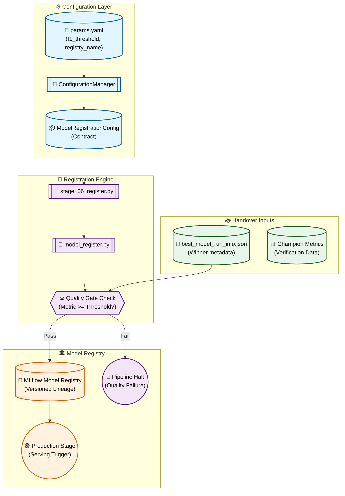

# Stage 11: Automated Model Registration Anatomy

## 1. Executive Summary
The **Model Registration** stage (`src/components/model_register.py`) is the final gatekeeper of the Agentic MLOps pipeline. It automates the transition from experimental research to production serving by promoting the "Champion" model to the **MLflow Model Registry**.

This stage acts as the **Policy Enforcer**. It reads the **Handover Contract** produced by the Evaluation stage, verifies the model's performance against a pre-defined **Quality Gate** (minimum F1 threshold), and executes the formal registration and versioning logic required for continuous deployment.

---

## 2. Architectural Flow

The following diagram illustrates the promotion policy and the transition to the production-ready model registry.



---

## 3. Component Interaction

### A. The Registration Conductor (`src/pipeline/stage_06_register_model.py`)
Parses the `best_model_run_info.json` to extract the winning `run_id` and the model's performance metrics. It initializes the registration worker only if a valid champion is identified.

### B. The Policy Engine (`src/components/model_register.py`)
Implements the core logic for promotion:
- **Threshold Verification:** Compares the champion's `Macro F1` against the `f1_threshold` in `params.yaml`. This prevents "degenerate" models (caused by bad data or training noise) from ever reaching production.
- **Atomic Registration:** Uses the `mlflow.register_model()` API to link a specific experiment run to a named model version in the registry.

### C. Version Transition Logic
Once registered, the component programmatically transitions the version to the **"Production"** stage. This transition acts as the "Event Trigger" for the FastAPI Inference Service and the Content Intelligence Analyst agent, signaling that a fresh, validated brain is ready for queries.

---

## 4. DVC Pipeline Setup

### `dvc.yaml` Stage Definition
Tracks the evaluation contract as the primary dependency.

```yaml
  register_model:
    cmd: python src/pipeline/stage_06_register_model.py
    deps:
      - artifacts/model_evaluation/best_model_run_info.json
      - src/pipeline/stage_06_register_model.py
      - src/components/model_register.py
    params:
      - config/params.yaml:
        - model_registration.f1_threshold
```
*Note: This stage has no local `outs` because its primary output is the side-effect of updating the remote MLflow Model Registry.*

---

## 5. MLOps Design Principles

1.  **Contract-First Delivery:**
    The stage relies exclusively on the JSON contract from the evaluation stage. This decouples "Research" (picking a model) from "Operations" (putting a model into a register), allowing for independent testing of the registration logic.

2.  **Infrastructure as Policy:**
    The inclusion of the `f1_threshold` directly in the training DAG ensures that the "Definition of Done" for a model is encoded in the pipeline's configuration, not in manual human decisions.

3.  **Auditability & Lineage:**
    By utilizing the MLflow Model Registry, the system maintains a perfect audit trail. Every production model can be traced back through its Registry Version $\rightarrow$ Experiment Run $\rightarrow$ DVC Data Artifacts $\rightarrow$ Source YouTube Comments.

4.  **Continuous Deployment Readiness:**
    The automated transition to the "Production" stage enables a full **Automated Retraining Loop**. When new data is ingested, the pipeline refines the model and updates the registry without human intervention, provided the Quality Gate is satisfied.
