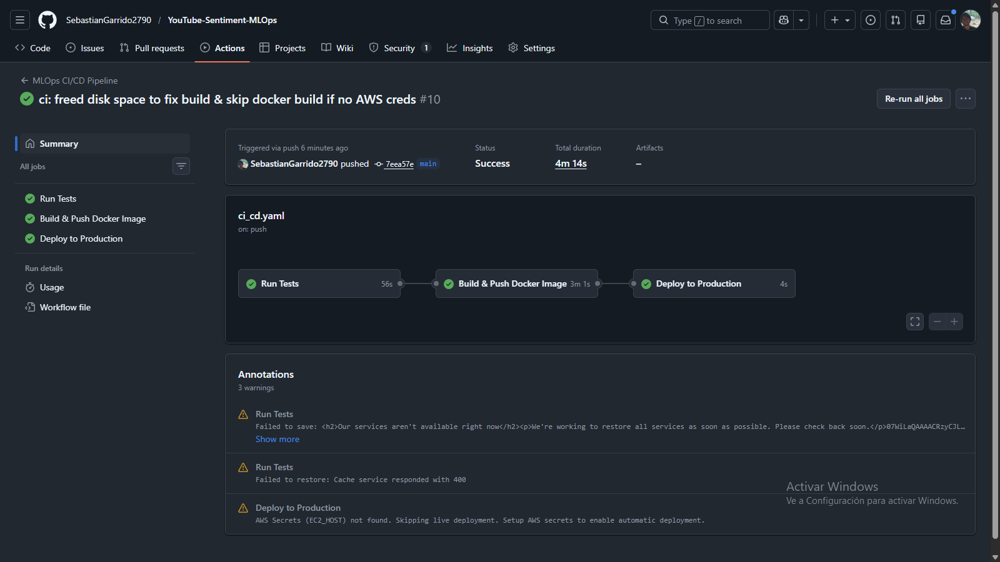

# CI/CD Pipeline for MLOps

This document provides an overview of the Continuous Integration and Continuous Deployment (CI/CD) pipeline for the YouTube Sentiment Analysis project. The pipeline is designed to automate testing, building, securing, and deploying the application, ensuring it aligns with modern MLOps principles of Reliability, Scalability, and Maintainability.

## 1. Overview

The primary purpose of this pipeline is to provide a fast, reliable, and automated way to validate code changes and deploy production-ready artifacts. It integrates several key MLOps practices:


*Figure: Complete CI/CD Workflow showing Test, Build, and Deploy stages.*

-   **Automated Testing**: Ensures that every change is automatically tested for correctness and quality.
-   **Data and Model Versioning**: Uses DVC to pull versioned data for reproducible tests.
-   **Containerization**: Builds a Docker image as a versioned, deployable artifact.
-   **Security Scanning**: Proactively scans the application and its dependencies for vulnerabilities.
-   **Continuous Deployment**: Automatically deploys the application to a production-like environment after successful testing and building.

## 2. Pipeline Triggers

The pipeline is automatically triggered by the following GitHub events:

-   **Push to `main`**: When code is pushed directly to the `main` branch.
-   **Pull Request**: When a pull request is opened or updated that targets the `main` branch.

The pipeline also uses a `concurrency` setting to automatically cancel any in-progress runs for the same branch or pull request, ensuring that only the latest commit is processed.

```yaml
on:
  push:
    branches: [ main ]
  pull_request:
    branches: [ main ]

concurrency:
  group: ${{ github.workflow }}-${{ github.event.pull_request.number || github.ref }}
  cancel-in-progress: true
```

## 3. Pipeline Jobs

The pipeline is composed of three main jobs: `test`, `build`, and `deploy`.

### 3.1 `test` Job

Runs on every push and pull request to ensure code quality and integrity.

**Key Steps:**
1.  **Checkout Code**: Checks out the repository.
2.  **Install uv**: Sets up the fast Python package manager `uv` with caching enabled.
3.  **Install Dependencies**: Runs `uv sync --all-extras --dev` to install the project environment.
4.  **Linting & Formatting**: Runs `ruff check` and `ruff format --check` to enforce strict code style.
5.  **Pull DVC Data**: Uses `dvc pull` to fetch data/models from S3 (if AWS credentials are provided).
6.  **Run Tests**: Executes `pytest` to validate the codebase.
    -   **NLTK Setup**: Automatically downloads required NLTK resources (`punkt`, `stopwords`) via `tests/conftest.py` before running tests.

### 3.2 `build` Job

Runs **only on pushes to `main`** after tests pass.

**Key Steps:**
1.  **Configure AWS**: Authenticates to AWS to access ECR (Conditional: Skips if secrets are missing).
2.  **Login to ECR**: Logs into Amazon Elastic Container Registry (Conditional: Skips if secrets are missing).
3.  **Security Scan (Trivy)**: Scans the filesystem for vulnerabilities using `aquasecurity/trivy-action`.
    -   Report level: `CRITICAL,HIGH`
    -   **Non-blocking**: The pipeline will continue even if issues are found, allowing manual review.
4.  **Build and Push (Conditional Logic)**:
    -   **If AWS Secrets Exist**: Builds the Docker image and **pushes** it to AWS ECR with `latest` and commit SHA tags.
    -   **If AWS Secrets Missing**: Performs a **Local Build Verification** (builds the image without pushing) to ensure `Dockerfile` validity and catch build errors, ensuring a green pipeline even without cloud credentials.
    -   **Caching**: Uses GitHub Actions Caching for both scenarios to speed up builds.

### 3.3 `deploy` Job

Runs after a successful build on `main`.

**Key Steps:**
1.  **Environment Check**: Checks if the `EC2_HOST` secret is set.
    -   **Safe Skip**: If `EC2_HOST` is missing (e.g., no live server configured), it outputs a warning and exits gracefully. This prevents pipeline failures for users without active infrastructure.
2.  **Deployment (Stub)**: If credentials exist, it would connect to the EC2 instance, pull the new image, and restart the container.

## 4. How to Run the Pipeline

The pipeline triggers automatically on Git events.

### 4.1. Prerequisites (Secrets)

To enable all features, configure these secrets in **Settings > Secrets and variables > Actions**:

**Required for DVC & ECR:**
-   `AWS_ACCESS_KEY_ID`: Your AWS Access Key.
-   `AWS_SECRET_ACCESS_KEY`: Your AWS Secret Key.
-   `AWS_REGION`: AWS Region (e.g., `us-east-1`).
-   `ECR_REPOSITORY`: Name of your ECR repository (e.g., `youtube-sentiment`).

**Required for Deployment (Optional):**
-   `EC2_HOST`: IP address or DNS of your production server.
-   `EC2_USER`: SSH user (e.g., `ubuntu`).
-   `EC2_KEY`: Private SSH key content.

### 4.2. Developer Workflow

1.  **Work on a Branch**: Create a feature branch.
2.  **Push Changes**: Pushing triggers the `test` job (Lint + Test).
3.  **Open PR**: Opening a PR also triggers the `test` job.
4.  **Merge to `main`**:
    -   Triggers `test`.
    -   If tests pass, triggers `build` (Scan + Build + Push).
    -   If build succeeds, triggers `deploy` (Live Deployment or Safe Skip).
