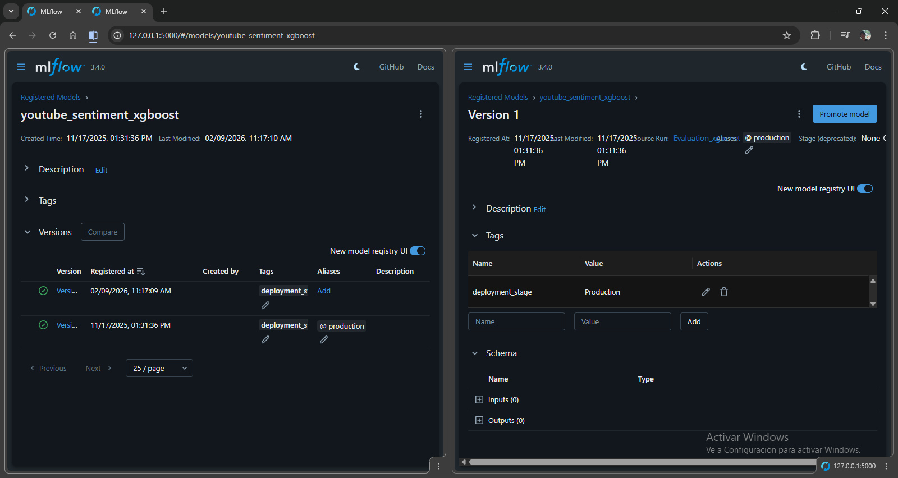

# DVC and MLflow for Reproducible MLOps

This document provides a comprehensive overview of how DVC (Data Version Control) and MLflow are integrated into this project to create a reproducible, automated, and maintainable MLOps workflow.

## 1. Overview: The "Why"

In MLOps, the goal is to bridge the gap between model development and operations. This requires two key capabilities that Git alone cannot provide:
1.  **Versioning large files**: Git is not designed to handle large datasets, models, or other binary artifacts.
2.  **Tracking experiments**: A typical project involves dozens if not hundreds of experiments with different parameters and code versions. Tracking which parameters produced which model is critical.

This project solves these challenges by combining DVC and MLflow:
-   **DVC** acts as the pipeline orchestrator and data/model version control system.
-   **MLflow** acts as the experiment tracker and model registry.

Together, they provide end-to-end lineage, from data ingestion to model deployment.

## 2. DVC: The Pipeline and Data Versioning Layer

DVC extends Git by adding capabilities to version large files and define a reproducible pipeline.

### How it Works in This Project

#### `dvc.yaml`: The MLOps Pipeline Definition
The `dvc.yaml` file defines the entire ML pipeline as a Directed Acyclic Graph (DAG). Each `stage` is a step in the pipeline with defined inputs and outputs.

**Example: The `feature_engineering` stage**
```yaml
feature_engineering:
  cmd: python -m src.features.feature_engineering
  deps:
    - data/processed/train.parquet
    - data/processed/val.parquet
    - data/processed/test.parquet
    - src/features/feature_engineering.py
    - src/utils/logger.py
    - src/utils/paths.py
    - src/features/helpers/feature_utils.py
  params:
    - feature_engineering.use_distilbert
    - feature_engineering.distilbert_batch_size
    - imbalance_tuning.best_max_features
    - imbalance_tuning.best_ngram_range
  outs:
    - models/features/
```
-   **`cmd`**: The command to execute (using `python -m` to run valid modules).
-   **`deps`**: Dependencies. If any of these files change (e.g., source code or input data), DVC knows to re-run this stage.
-   **`params`**: Parameters from `params.yaml`. Listing them ensures DVC detects configuration changes.
-   **`outs`**: Outputs. DVC tracks the directory `models/features/`, storing the actual data in DVC's cache.

#### `params.yaml`: Centralized Configuration
The `params.yaml` file centralizes all pipeline parameters, from data split ratios to model hyperparameters. This is a core MLOps principle for **Adaptability** and **Reproducibility**.

**Example:**
```yaml
imbalance_tuning:
  imbalance_methods:
    - class_weights
    - oversampling
  best_max_features: 1000
  best_ngram_range: [1, 1]
```

### MLOps Advantages of DVC
-   **Reproducibility**: DVC tracks the exact version of code, data, and parameters.
-   **Efficiency**: DVC only re-runs stages where dependencies or parameters have changed (smart caching).
-   **Collaboration**: Team members share large datasets and models via remote storage (e.g., S3, separate from Git).

### How to Use DVC in This Project
1.  **Reproduce the Pipeline**:
    ```bash
    dvc repro
    ```
2.  **Run Specific Stage**:
    ```bash
    dvc repro feature_engineering
    ```

## 3. MLflow: The Experiment Tracking and Model Registry Layer

MLflow is used to log the details of every experiment and manage the lifecycle of trained models.

### How it Works in This Project

#### Experiment Tracking (`src/features/**` & `src/models/**`)
Scripts are instrumented with MLflow logging.

**Example usage in `src/models/hyperparameter_tuning.py`:**
```python
# Parent run for the study
with mlflow.start_run(run_name=f"{model_name.upper()}_Optuna_Study") as parent_run:
    # ...
    # Nested run for each trial
    with mlflow.start_run(run_name=f"Trial_{trial.number}", nested=True):
        mlflow.log_params(params)
        mlflow.log_metric("val_macro_f1", f1)
```

#### Model Registry (`src/models/register_model.py`)
After evaluation, the best-performing model (the "champion") is registered:

1.  **Selection**: The `model_evaluation` stage compares models on the Test Set and writes `best_model_run_info.json`.
2.  **Registration**: The `register_model` stage reads this info.
3.  **Gatekeeping**: It checks if `test_macro_f1` >= `register.f1_threshold` (from `params.yaml`).
4.  **Promotion**: If passed, the model is registered in MLflow and tagged/promoted for production.

### How to Use MLflow in This Project
1.  **Start the MLflow UI**:
    ```bash
    uv run python -m mlflow server --host 127.0.0.1 --port 5000
    ```
2.  **View Experiments**: Open `http://127.0.0.1:5000` to browse runs.
3.  **View Registered Models**: Navigate to the "Models" tab.


*Figure: MLflow UI Dashboard showing experiments and registered models.*

## 4. The Combined DVC + MLflow Workflow

1.  **Change Parameter**: Modify `params.yaml` (e.g., `xgboost.n_trials`).
2.  **Run Pipeline**: `dvc repro`.
3.  **DVC Action**: Detects change, re-runs tuning stage.
4.  **MLflow Action**: Logs new trials as nested runs.
5.  **DVC Output**: Updates `dvc.lock` and output artifacts.
6.  **Comparison**: Use MLflow UI to compare new results against old ones.
7.  **Commit**: Git commit `dvc.lock` and `params.yaml` to save the state.

## ⚙️ Configuration Management (`src/config/manager.py`)

We use a strong configuration pattern:
-   **`params.yaml`**: The source of truth.
-   **`ConfigurationManager`**: A Python singleton that correctly loads and validates these parameters using **Pydantic** schemas.
-   **Usage**: Scripts typically initialize `config = ConfigurationManager()` and access typed config objects (e.g., `config.get_train_config()`). This replaces loose `dvc.api` calls and adds type safety.