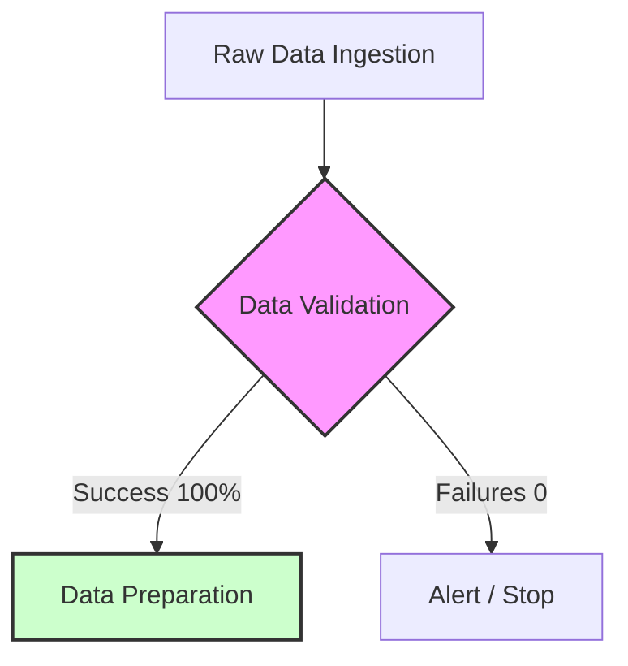

# Data Validation Report: YouTube Sentiment Analysis

This report documents the statistical validation of the raw dataset using **Great Expectations (GX)**. The validation ensures that the data ingested into the pipeline adheres to the defined quality contracts before moving to the feature engineering and training stages.

## 📊 Executive Summary

| Metric | Value |
| :--- | :--- |
| **Validation Status** | ✅ **PASSED** |
| **Success Rate** | 100% |
| **Total Expectations** | 6 |
| **Total Rows Evaluated** | 37,249 |
| **Run Date** | 2026-04-08 |

---

## 🔍 Validation Suite: `youtube_sentiment_raw_suite`

The following expectations were evaluated against the raw dataset:

### 1. Schema & Existence
| Expectation | Column | Severity | Status |
| :--- | :--- | :--- | :--- |
| `expect_column_to_exist` | `clean_comment` | Critical | ✅ |
| `expect_column_to_exist` | `category` | Critical | ✅ |

### 2. Quality & Completeness
| Expectation | Column | Target (Mostly) | Actual | Status |
| :--- | :--- | :--- | :--- | :--- |
| `expect_column_values_to_not_be_null` | `clean_comment` | 95.0% | 99.73% | ✅ |
| `expect_column_values_to_not_be_null` | `category` | 100.0% | 100.0% | ✅ |

### 3. Data Integrity & Constraints
| Expectation | Column | Target (Mostly) | Details | Status |
| :--- | :--- | :--- | :--- | :--- |
| `expect_column_value_lengths_to_be_between` | `clean_comment` | 95.0% | 2 - 5000 chars | ✅ |
| `expect_column_values_to_be_in_set` | `category` | 99.0% | {-1, 0, 1} | ✅ |

---

## 📈 Detailed Findings

### `clean_comment` Column
- **Null Values**: 100 rows (0.27%) were null. This is well within the 5.0% allowance (Target: >95% non-null).
- **Text Length**: 153 rows (0.41%) failed the length constraint (2-5000 chars). Usually, these are single-character comments or exceptionally long strings. Since we only require 95% compliance, this is considered healthy.

### `category` Column
- **Integrity**: 100% of labels are populated and belong to the expected set `{-1, 0, 1}` (Negative, Neutral, Positive). No unexpected labels detected.

---

## 🛠️ Infrastructure Information
- **GX Version**: `1.15.2`
- **Artifacts Directory**: `artifacts/gx/`
- **Pipeline Stage**: `stage_01b_data_validation`

> [!TIP]
> **Data Quality Insight**: The low null percentage (0.27%) and perfect label set (100%) indicate a high-quality raw dataset. The pipeline is safe to proceed to downstream feature engineering.
