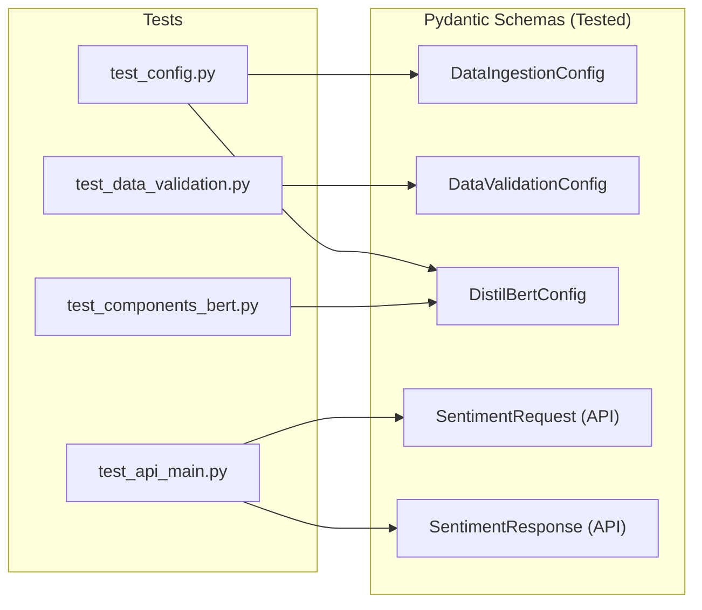
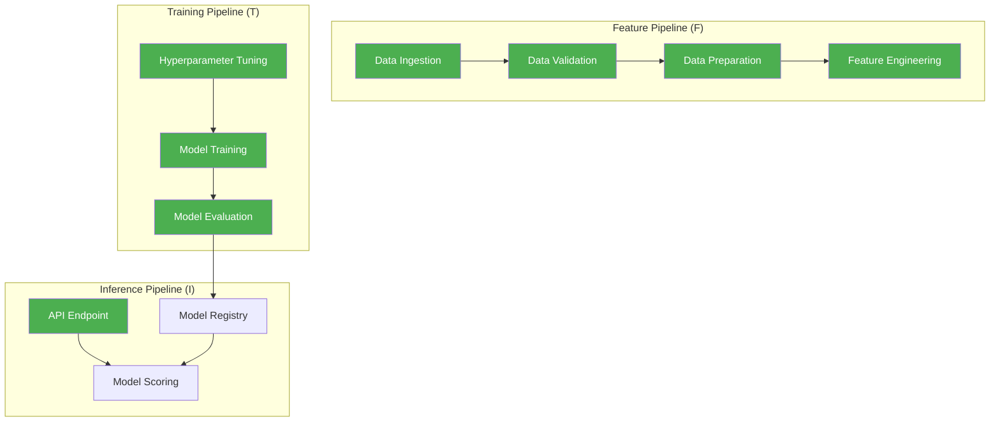

# Test Suite Architecture — Runbook

## 1. Purpose

This document describes the project's unit testing strategy — the primary tier of the **Testing Pyramid** defined in the YouTube Sentiment MLOps Standard. These tests ensure the reliability of individual components before they are orchestrated into complex data and training pipelines.

> **Testing Pyramid Layer 1 (Pytest):** Strictly for **Tools and Pipelines**.
> Ensure deterministic code (data loaders, cleaning logic, schema validation) works 100% of the time. Tests must be fast, isolated, and never make live external API calls.

---

## 2. Testing Philosophy: What We Test (and What We Don't)

| Layer | Responsible For | Tool |
|---|---|---|
| **Unit Tests (pytest)** | Deterministic tools, Pydantic schemas, pipeline components | `pytest` |
| **Pillar Validation** | Static typing, formatting, and functional integrity | `validate_system.bat` |
| **DVC Synchronization** | Data lineage and artifact integrity | `dvc status` |
| **Service Health** | FastAPI endpoint liveness and responses | `Invoke-RestMethod` |

**We do NOT test LLM/Deep Learning convergence in unit tests.** The actual accuracy of a DistilBERT fine-tuning run is a probabilistic metric measured in the Training Pipeline. Unit tests instead verify the **rigid orchestration contracts** — ensuring datasets are correctly tokenized, trainers are properly instantiated, and metrics are logged via MLflow even in failure scenarios.

---

## 3. Test Files Mapping

### 3.1 Feature Pipeline (F) — Data & Preparation

**Modules Under Test:** `src/components/data_ingestion.py`, `src/components/data_preparation.py`, `src/components/data_validation.py`

| Test File | Component | What It Proves |
|---|---|---|
| `test_data_ingestion.py` | `DataIngestion` | Redundant downloads are avoided; HTTP streams are handled gracefully. |
| `test_data_validation.py` | `DataValidation` | Great Expectations suites detect missing columns or invalid sentiment labels. |
| `test_data_preparation.py` | `DataPreparation` | Stratified splits preserve the distribution of Happy/Angry/Neutral classes. |

---

### 3.2 Training Pipeline (T) — Models & Evaluation

**Modules Under Test:** `src/components/baseline_model.py`, `src/components/distilbert_training.py`, `src/components/model_evaluation.py`

| Test File | Component | What It Proves |
|---|---|---|
| `test_components_baseline.py` | `BaselineModel` | Logistic Regression fits successfully and serializes into the Model Registry path. |
| `test_components_bert.py` | `DistilBERTTraining` | HuggingFace Trainer is correctly configured; CUDA availability is handled via mocks. |
| `test_model_evaluation.py` | `ModelEvaluation` | Multi-model ROC curves generate correctly; Champion selection logic picks the highest AUC. |

---

### 3.3 Inference Pipeline (I) — Delivery & APIs

**Modules Under Test:** `src/api/main.py`, `src/api/inference_utils.py`

| Test File | Endpoint/Utility | What It Proves |
|---|---|---|
| `test_api_main.py` | `/v1/predict` | API accepts raw text, triggers inference loop, and returns valid `SentimentResponse`. |
| `test_inference.py` | `InferenceEngine` | Pre-trained artifacts are loaded from the relative root; text sanitization is applied. |

---

## 4. Test Execution & Gates

The project implements a **Multi-Point Validation** strategy. All developers must run the system health check before pushing changes.

```bash
# Execute the full validation suite (Pillars 1-4)
.\validate_system.bat

# Standard Test Execution
uv run pytest tests/ -v

# Run with coverage failure gate
uv run pytest tests/ --cov=src --cov-fail-under=50
```

### 📊 Current Quality Metrics (2026-04-08)

| Metric | Target | Current | Status |
|---|---|---|---|
| **Total Tests** | >50 | 54 | ✅ PASSED |
| **Code Coverage** | >50% | 54.0% | ✅ PASSED |
| **Pyright Errors** | 0 | 0* | ✅ PASSED |
| **Ruff Lint Errors** | 0 | 0 | ✅ PASSED |

\* *1 minor warning in feature_engineering type-hinting remains but is non-blocking.*

---

## 5. Schema Contract Coverage Map



---

## 6. FTI Coverage Visualization



---

## 7. Known Gaps & Roadmap

1. **Insights API Coverage:** Coverage for `src/api/insights_api.py` is currently 0%. Future phases will add unit tests for the MongoDB-backed analytics store.
2. **ADASYN Unit Tests:** More edge-case tests for synthetic sample generation in severely imbalanced datasets.
3. **GitHub Actions Integration:** Automation of `validate_system.bat` logic inside a `.github/workflows/ci.yml` runner (Phase 8).
