# Stage 01: Data Ingestion Report

## 1. Executive Summary
The **Data Ingestion** stage (`src/data/download_dataset.py`) is the foundational step of the MLOps pipeline. Its sole responsibility is to securely fetch the raw dataset from an external source (in this case, a GitHub raw URL acting as a proxy for a data lake) and persist it locally for subsequent processing.

By decoupling ingestion from processing, we ensure:
- **Immutability:** The raw data is preserved in its original state.
- **Reproducibility:** DVC tracks the exact version of the data downloaded.
- **Resilience:** Network failures or source changes are isolated to this single stage.

---

## 2. Architectural Flow

The following Mermaid diagram illustrates the data flow for this stage:

```mermaid
graph TD
    classDef config fill:#e1f5fe,stroke:#01579b,stroke-width:2px,color:#000000;
    classDef process fill:#f3e5f5,stroke:#4a148c,stroke-width:2px,color:#000000;
    classDef storage fill:#e8f5e9,stroke:#1b5e20,stroke-width:2px,color:#000000;

    subgraph Configuration_Layer ["⚙️ Configuration Layer "]
        Params[("📄 params.yaml<br>(Source of Truth)")]:::config
        Schema[("🛡️ Pydantic Schema<br>(Validation Rules)")]:::config
        ConfigMgr[["💼 ConfigurationManager<br>(Singleton)"]]:::config
        
        Params -->|Load Raw YAML| ConfigMgr
        Schema -.->|Enforce Types| ConfigMgr
        ConfigMgr -->|Return Typed Config| IngestionConfig[("📦 DataIngestionConfig<br>(Immutable Object)")]:::config
    end

    subgraph Execution_Layer ["🚀 Execution Layer "]
        Script[["🐍 src/data/download_dataset.py<br>(DVC Stage)"]]:::process
        External[("🌐 External Source<br>(GitHub Raw Proxy)")]:::process
        
        IngestionConfig -->|Provide URL & Path| Script
        External -->|HTTPS GET Request| Script
    end

    subgraph Storage_Layer ["💾 Storage & Versioning "]
        RawData[("📝 data/raw/reddit_comments.csv<br>(Artifact)")]:::storage
        DVCLock[("🔒 dvc.lock<br>(Reproducibility Hash)")]:::storage
        
        Script -->|Write Stream| RawData
        RawData -.->|Track MD5 Hash| DVCLock
    end
```



---

## 3. Component Interaction

This stage interacts with several key system components to ensure robust execution:

### A. Configuration Management
The script does **not** hardcode URLs or paths. Instead, it relies on the `ConfigurationManager` singleton to potentially load and valid parameters.
- **Source:** `params.yaml`
- **Validation:** `src.config.schemas.DataIngestionConfig` (Pydantic model)
- **Access:** `config.url`, `config.output_path`

### B. Logging
Uses the centralized `src.utils.logger` to provide detailed execution logs, including:
- Configuration loading status.
- Download progress and file creation.
- Error handling (e.g., network timeouts, file permission issues).

### C. DVC Integration
The script is designed to be run as a DVC stage. DVC monitors:
- **Dependencies:** The script itself and utilities (`src/utils/`).
- **Parameters:** `data_ingestion.url` in `params.yaml`.
- **Outputs:** The downloaded file `data/raw/reddit_comments.csv`.

---

## 4. DVC and Configuration Setup

### `dvc.yaml` Stage Definition
This configuration ensures that the stage is only re-run if the URL changes or the script code is modified.

```yaml
stages:
  data_ingestion:
    cmd: python -m src.data.download_dataset
    deps:
      - src/data/download_dataset.py
      - src/utils/logger.py
      - src/utils/paths.py
    params:
      - data_ingestion.url
      - data_ingestion.output_path
    outs:
      - data/raw/reddit_comments.csv
```

### `params.yaml` Configuration
Centralized control of external resources.

```yaml
data_ingestion:
  url: "https://raw.githubusercontent.com/Himanshu-1703/reddit-sentiment-analysis/refs/heads/main/data/reddit.csv"
  output_path: "data/raw/reddit_comments.csv"
```

---

## 5. Why This is "Robust MLOps"

This implementation moves beyond simple scripting to production-grade engineering:

1.  **Strict Type Safety:**
    By using **Pydantic** schemas via `ConfigurationManager`, we guarantee that configuration errors (e.g., missing URL, invalid path type) are caught at startup, not mid-execution.

2.  **Single Source of Truth:**
    We effectively **removed CLI overrides (`argparse`)**. This enforces that the only way to change the dataset URL is by updating `params.yaml`. This is critical for DVC, as DVC only tracks `params.yaml`, not transient CLI arguments. If we allowed CLI overrides, an experiment could be run with a different dataset but appear identical in the DVC history.

3.  **Reproducibility:**
    The combination of DVC tracking the output file hash and Git tracking the code ensures that any historic version of the dataset can be restored exactly.

4.  **Error Handling & Logging:**
    The script includes robust error handling for network requests (timeouts, status codes) and file I/O, ensuring that failures are reported clearly with actionable logs.
