# Stage 02: Data Preparation Report

## 1. Executive Summary
The **Data Preparation** stage (`src/data/make_dataset.py`) transforms the raw, immutable data into clean, structured datasets ready for modeling. This stage is critical for ensuring data quality and consistency across all downstream tasks.

Key operations performed:
- **Cleaning:** Text normalization (lowercasing, strict regex filtering) and stopword removal.
- **Label Encoding:** Mapping raw sentiment labels `{-1, 0, 1}` to standardized non-negative integers `{0, 1, 2}`.
- **Stratified Splitting:** Partitioning data into **Train (70%)**, **Validation (15%)**, and **Test (15%)** sets while preserving the class distribution.
- **Persistance:** Saving processed splits as high-performance **Parquet** files.

---

## 2. Architectural Flow

The following Mermaid diagram illustrates the data flow for this stage:

```mermaid
graph TD
    classDef config fill:#e1f5fe,stroke:#01579b,stroke-width:2px,color:#000000;
    classDef process fill:#f3e5f5,stroke:#4a148c,stroke-width:2px,color:#000000;
    classDef storage fill:#e8f5e9,stroke:#1b5e20,stroke-width:2px,color:#000000;

    subgraph Configuration_Layer ["⚙️ Configuration Layer "]
        Params[("📄 params.yaml<br>(Test Size, Seed)")]:::config
        Schema[("🛡️ Pydantic Schema<br>(Validation Rules)")]:::config
        ConfigMgr[["💼 ConfigurationManager<br>(Singleton)"]]:::config
        
        Params -->|Load| ConfigMgr
        Schema -.->|Enforce Types| ConfigMgr
        ConfigMgr -->|Return Typed Config| PrepConfig[("📦 DataPreparationConfig<br>(Immutable)")]:::config
    end

    subgraph Execution_Layer ["🚀 Execution Layer "]
        Script[["🐍 src/data/make_dataset.py<br>(DVC Stage)"]]:::process
        Cleaning[["🧹 Text Cleaning<br>(NLTK + Regex)"]]:::process
        Splitting[["✂️ Stratified Split<br>(Sklearn)"]]:::process
        
        PrepConfig -->|Provide Params| Script
        Script --> Cleaning
        Cleaning --> Splitting
    end

    subgraph Storage_Layer ["💾 Storage & Versioning "]
        RawData[("📝 data/raw/reddit_comments.csv<br>(Input)")]:::storage
        Processed[("📚 data/processed/*.parquet<br>(Train/Val/Test)")]:::storage
        DVCLock[("🔒 dvc.lock<br>(Reproducibility Hash)")]:::storage
        
        RawData -->|Read| Script
        Splitting -->|Write| Processed
        Processed -.->|Track Hash| DVCLock
    end
```



---

## 3. Component Interaction

### A. Configuration Management
This stage utilizes `ConfigurationManager` to safely load hyperparameters, ensuring that data splitting is consistent and reproducible.
- **Source:** `params.yaml`
- **Validation:** `src.config.schemas.DataPreparationConfig`
- **Parameters:** `test_size`, `random_state`

### B. Dependency Management & logging
- **NLTK Integration:** Automatically checks for and downloads necessary NLTK resources (`stopwords`, `punkt`) at runtime.
- **Logging:** Detailed logs track dataset shape changes, label distributions (before/after encoding), and final split sizes.

### C. DVC Integration
DVC ensures that the expensive preparation step is only re-run when necessary.
- **Dependencies:** Raw data (`data/raw/reddit_comments.csv`) and the script itself.
- **Outputs:** Three distinct Parquet files (`train.parquet`, `val.parquet`, `test.parquet`).

---

## 4. DVC and Configuration Setup

### `dvc.yaml` Stage Definition
Explicitly defines inputs and outputs to construct the DAG.

```yaml
stages:
  data_preparation:
    cmd: python -m src.data.make_dataset
    deps:
      - data/raw/reddit_comments.csv
      - src/data/make_dataset.py
      - src/utils/logger.py
      - src/utils/paths.py
    params:
      - data_preparation.test_size
      - data_preparation.random_state
    outs:
      - data/processed/train.parquet
      - data/processed/val.parquet
      - data/processed/test.parquet
```

### `params.yaml` Configuration
Controls the split ratios and seed.

```yaml
data_preparation:
  test_size: 0.15
  random_state: 42
```

---

## 5. Why This is "Robust MLOps"

1.  **Strict Type Safety:**
    The `test_size` parameter is strictly validated as a float. If a user accidentally provides a string or an invalid number in `params.yaml`, the pipeline fails fast with a clear error message from Pydantic.

2.  **Stateless Execution:**
    The script does not rely on global state. It downloads its own NLTK dependencies and reads strictly from defined inputs, making it container-ready.

3.  **Data Integrity:**
    - **Label Encoding:** Explicitly maps disparate labels to a contiguous integer range `{0, 1, 2}`, preventing errors in downstream libraries (e.g., XGBoost) that expect specific label formats.
    - **Parquet Format:** Uses Parquet for output, which preserves data types (unlike CSV) and is significantly faster for I/O operations in the training stage.

4.  **Reproducibility:**
    The removal of CLI overrides guarantees that the datasets generated today can be exactly recreated in the future by checking out the commit and running `dvc repro`.
