# Stage 03: Feature Comparison Report

## 1. Executive Summary
The **Feature Comparison** stage (`src/features/tfidf_vs_distilbert.py`) evaluates different text representation strategies (**TF-IDF** n-grams vs. **DistilBERT** embeddings) to determine the best approach for sentiment classification.

Crucially, this stage is **transient**: it does not produce versioned artifacts (like models or datasets) for downstream use. Instead, its primary output is **metadata** logged to MLflow (metrics, parameters, confusion matrices). This allows us to make data-driven decisions about which feature engineering path to pursue in subsequent stages.

---

## 2. Architectural Flow

The following Mermaid diagram illustrates the experiment flow:

```mermaid
graph TD
    classDef config fill:#e1f5fe,stroke:#01579b,stroke-width:2px,color:#000000;
    classDef process fill:#f3e5f5,stroke:#4a148c,stroke-width:2px,color:#000000;
    classDef external fill:#fff3e0,stroke:#e65100,stroke-width:2px,color:#000000;

    subgraph Configuration_Layer ["⚙️ Configuration Layer "]
        Params[("📄 params.yaml<br>(N-grams, DistilBERT flag)")]:::config
        Schema[("🛡️ Pydantic Schema<br>(Validation Rules)")]:::config
        ConfigMgr[["💼 ConfigurationManager<br>(Singleton)"]]:::config
        
        Params -->|Load| ConfigMgr
        Schema -.->|Enforce Types| ConfigMgr
        ConfigMgr -->|Return Typed Config| ExpConfig[("📦 FeatureComparisonConfig<br>(Immutable)")]:::config
    end

    subgraph Execution_Layer ["🚀 Execution Layer "]
        Script[["🐍 src/features/tfidf_vs_distilbert.py<br>(DVC Stage)"]]:::process
        DataLoad[["📥 Load Processed Data<br>(Train/Val Parquet)"]]:::process
        
        subgraph Experiments ["🔬 Experiments (Iterative)"]
            TFIDF[["🧮 TF-IDF Vectorization<br>(1-gram, 2-gram, etc.)"]]:::process
            BERT[["🤖 DistilBERT Embeddings<br>(Optional GPU Inference)"]]:::process
            Train[["🌲 RandomForest Training<br>(Baseline Model)"]]:::process
        end
        
        ExpConfig -->|Configure| Script
        Script --> DataLoad
        DataLoad --> TFIDF
        DataLoad --> BERT
        TFIDF --> Train
        BERT --> Train
    end

    subgraph Logging_Layer ["📊 Logging & Monitoring "]
        MLflow[["📈 MLflow Server<br>(Tracking URI)"]]:::external
        Metrics[("📏 Metrics<br>(Accuracy, F1, Recall)")]:::external
        Plots[("🖼️ Artifacts<br>(Confusion Matrix)")]:::external
        
        Train -->|Log Run| MLflow
        MLflow -.-> Metrics
        MLflow -.-> Plots
    end
```



---

## 3. Component Interaction

### A. Configuration Management
Configures the experiment search space.
- **Source:** `params.yaml`
- **Validation:** `src.config.schemas.FeatureComparisonConfig`
- **Parameters:**
    - `ngram_ranges`: List of token n-grams to test (e.g., `[[1,1], [1,2]]`).
    - `max_features`: Vocabulary size limit.
    - `use_distilbert`: Boolean flag to enable/disable expensive deep learning embeddings.
    - `mlflow_uri`: Destination for experiment logs.

### B. Feature Engineering
- **TF-IDF:** Uses `sklearn.feature_extraction.text.TfidfVectorizer`.
- **DistilBERT:** Uses `transformers` and `torch` to generate dense context-aware embeddings (768 dimensions), utilizing GPU if available.

### C. MLflow Integration
Each configuration (e.g., "TFIDF 1-gram", "DistilBERT") runs as a separate **nested run** or distinct run within the experiment "Exp - Feature Comparison".
- **Logs:** Parameters, metrics (Accuracy, F1, Precision, Recall), and the Confusion Matrix plot.

---

## 4. DVC and Configuration Setup

### `dvc.yaml` Stage Definition
Notice the absence of `outs`. This stage is for insight generation, not pipeline dependencies.

```yaml
stages:
  feature_comparison:
    cmd: python -m src.features.tfidf_vs_distilbert
    deps:
      - data/processed/train.parquet
      - data/processed/val.parquet
      - src/features/tfidf_vs_distilbert.py
      - src/utils/logger.py
    params:
      - feature_comparison.mlflow_uri
      - feature_comparison.ngram_ranges
      - feature_comparison.max_features
      - feature_comparison.use_distilbert
```

### `params.yaml` Configuration
Defines the experimental grid.

```yaml
feature_comparison:
  mlflow_uri: "http://127.0.0.1:5000"
  ngram_ranges:
    - [1, 1]
    - [1, 2]
  max_features: 5000
  use_distilbert: false
```

---

## 5. Why This is "Robust MLOps"

1.  **Experiment Tracking as Code:**
    Instead of ad-hoc Jupyter notebooks, we define experiments in `dvc.yaml` and `params.yaml`. This ensures that every experiment is reproducible and its parameters are versioned in Git.

2.  **Strict Configuration:**
    Using `ConfigurationManager` ensures that complex parameters like `ngram_ranges` (a list of lists) are validated before execution starts, preventing runtime crashes.

3.  **Conditional Execution:**
    The `use_distilbert` flag allows us to toggle expensive deep learning resources on/off via configuration, optimizing resource usage for quick iteration vs. deep research.

4.  **No Artifact Pollution:**
    By designing this stage to log to MLflow but produce no DVC outputs, we avoid cluttering our storage with experimental models that will likely be discarded. Only the *lessons learned* (metrics) are preserved.
