# Stage 04: TF-IDF Max Features Tuning Report

## 1. Executive Summary
The **Feature Tuning** stage (`src/features/tfidf_max_features.py`) performs hyperparameter optimization for the TF-IDF vectorizer. Specifically, it iterates through a range of `max_features` values (vocabulary size) to determine the optimal trade-off between model performance (accuracy/F1) and dimensionality.

Like the previous comparison stage, this is a **transient** stage focused on experiment tracking. It logs metrics for each `max_features` candidate to MLflow, allowing us to select the best parameter for the final feature engineering pipeline.

---

## 2. Architectural Flow

The following Mermaid diagram illustrates the tuning process:

```mermaid
graph TD
    classDef config fill:#e1f5fe,stroke:#01579b,stroke-width:2px,color:#000000;
    classDef process fill:#f3e5f5,stroke:#4a148c,stroke-width:2px,color:#000000;
    classDef external fill:#fff3e0,stroke:#e65100,stroke-width:2px,color:#000000;

    subgraph Configuration_Layer ["⚙️ Configuration Layer "]
        Params[("📄 params.yaml<br>(Max Features Values)")]:::config
        Schema[("🛡️ Pydantic Schema<br>(FeatureTuningConfig)")]:::config
        ConfigMgr[["💼 ConfigurationManager<br>(Singleton)"]]:::config
        
        Params -->|Load| ConfigMgr
        Schema -.->|Validate| ConfigMgr
        ConfigMgr -->|Return Config| TuningConfig[("📦 FeatureTuningConfig")]:::config
    end

    subgraph Execution_Layer ["🚀 Execution Layer "]
        Script[["🐍 src/features/tfidf_max_features.py"]]:::process
        DataLoad[["📥 Load Processed Data<br>(Train/Val Parquet)"]]:::process
        
        subgraph Tuning_Loop ["🔄 Tuning Loop (Iterative)"]
            TFIDF[["🧮 TF-IDF Vectorization<br>(Varying max_features)"]]:::process
            Train[["🌲 RandomForest Training<br>(Baseline Model)"]]:::process
        end
        
        TuningConfig -->|Iterate Values| Script
        Script --> DataLoad
        DataLoad --> TFIDF
        TFIDF --> Train
    end

    subgraph Logging_Layer ["📊 Logging & Monitoring "]
        MLflow[["📈 MLflow Server"]]:::external
        Metrics[("📏 Metrics<br>(Val Accuracy, F1)")]:::external
        
        Train -->|Log Run| MLflow
        MLflow -.-> Metrics
    end
```



---

## 3. Component Interaction

### A. Configuration Management
- **Source:** `params.yaml` under `feature_tuning`.
- **Validation:** `src.config.schemas.FeatureTuningConfig`.
- **Key Parameters:**
    - `max_features_values`: A list of integers (e.g., `[1000, 2000, 5000]`) defining the search space for vocabulary size.
    - `best_ngram_range`: The n-gram range selected from the previous stage (e.g., `[1, 1]`), used here to isolate the effect of vocabulary size.

### B. Feature Engineering (Tuning)
- **Vectorization:** `TfidfVectorizer` is instantiated repeatedly within a loop, each time with a different `max_features` value from the configuration.
- **Model:** A standard `RandomForestClassifier` (fixed hyperparameters) is used as a baseline to evaluate the quality of the features.

### C. MLflow Integration
- **Experiment:** "Exp - TFIDF Max Features"
- **Runs:** Each `max_features` value creates a separate MLflow run named `TFIDF_max_features_{value}`.
- **Logged Data:**
    - **Params:** `max_features`, `ngram_range`, `feature_dim`.
    - **Metrics:** Validation Accuracy, Precision, Recall, F1-Score.

---

## 4. DVC and Configuration Setup

### `dvc.yaml` Stage Definition
Similar to the comparison stage, this generates insights (metrics) rather than file artifacts.

```yaml
stages:
  feature_tuning:
    cmd: python -m src.features.tfidf_max_features
    deps:
      - data/processed/train.parquet
      - data/processed/val.parquet
      - src/features/tfidf_max_features.py
      - src/utils/logger.py
    params:
      - feature_tuning.max_features_values
      - feature_tuning.best_ngram_range
      - feature_tuning.n_estimators
      - feature_tuning.max_depth
    outs:
      - reports/figures/tfidf_max_features/
```

### `params.yaml` Configuration
Notice the native YAML list format for `max_features_values`, which is parsed by Pydantic as `List[int]`.

```yaml
feature_tuning:
  max_features_values:
    - 1000
    - 2000
    - 3000
    - 4000
    - 5000
    - 6000
    - 7000
    - 8000
    - 9000
    - 10000
  best_ngram_range: [1, 1]
  n_estimators: 200
  max_depth: 15
```

---

## 5. MLOps Design Principles

1.  **Grid Search as Code:**
    We treat hyperparameter tuning (grid search) as a codified pipeline step. This ensures that the search space and the results are reproducible and versioned.

2.  **Strict Typing:**
    The `FeatureTuningConfig` schema ensures that `max_features_values` is strictly a list of integers. If `params.yaml` contained a string or float, the pipeline would fail fast with a clear validation error.

3.  **Iterative Optimization:**
    This stage builds upon the previous one. We take the `best_ngram_range` discovered in `feature_comparison` and now refine the `max_features`. This stepwise approach isolates variables for clearer analysis.
