# Stage 05: Imbalance Handling Tuning Report

## 1. Executive Summary
The **Imbalance Tuning** stage (`src/features/imbalance_tuning.py`) evaluates various strategies to address the class imbalance inherent in the sentiment dataset (where positive samples often outnumber neutral/negative ones). The goal is to maximize minority class recall (and overall F1-score) without sacrificing overall accuracy.

This stage leverages the `imblearn` library to apply techniques like SMOTE, ADASYN, and Random Undersampling to the training data *after* TF-IDF vectorization.

---

## 2. Architectural Flow

The following Mermaid diagram illustrates the imbalance handling process:

```mermaid
graph TD
    classDef config fill:#e1f5fe,stroke:#01579b,stroke-width:2px,color:#000000;
    classDef process fill:#f3e5f5,stroke:#4a148c,stroke-width:2px,color:#000000;
    classDef external fill:#fff3e0,stroke:#e65100,stroke-width:2px,color:#000000;

    subgraph Configuration_Layer ["⚙️ Configuration Layer "]
        Params[("📄 params.yaml")]:::config
        Schema[("🛡️ Pydantic Schema")]:::config
        ConfigMgr[["💼 ConfigurationManager"]]:::config
        
        Params -->|Load| ConfigMgr
        Schema -.->|Validate| ConfigMgr
    end

    subgraph Execution_Layer ["🚀 Execution Layer "]
        Script[["🐍 src/features/imbalance_tuning.py"]]:::process
        DataLoad[["📥 Load Processed Data"]]:::process
        Vectorize[["🧮 TF-IDF Vectorization<br>(Fixed Best Params)"]]:::process
        
        subgraph Methods_Loop ["🔄 Methods Loop"]
            Resample[["⚖️ Resampling / Reweighting<br>(SMOTE, ADASYN, etc.)"]]:::process
            Train[["🌲 RandomForest Training"]]:::process
        end
        
        ConfigMgr -->|Iterate Methods| Script
        Script --> DataLoad
        DataLoad --> Vectorize
        Vectorize --> Resample
        Resample --> Train
    end

    subgraph Logging_Layer ["📊 Logging & Monitoring "]
        MLflow[["📈 MLflow Server"]]:::external
        Metrics[("📏 Metrics<br>(Class-wise Precision/Recall)")]:::external
        
        Train -->|Log Run| MLflow
        MLflow -.-> Metrics
    end
```



---

## 3. Component Interaction

### A. Configuration Management
- **Source:** `params.yaml` under `imbalance_tuning`.
- **Validation:** `src.config.schemas.ImbalanceTuningConfig`.
- **Key Parameters:**
    - `imbalance_methods`: List of strings (e.g., `['class_weights', 'oversampling', 'smote_enn']`) defining the strategies to test.
    - `best_max_features` & `best_ngram_range`: Optimal parameters fixed from previous stages.

### B. Resampling Strategies
The script iterates through the configured methods. Crucially, **resampling is only applied to the training set**. The validation set remains untouched to ensure a fair evaluation of real-world performance.

1.  **Class Weights:** No physical resampling. The model loss function is weighted inversely proportional to class frequencies.
2.  **Oversampling (SMOTE):** Synthetic Minority Over-sampling Technique. Generates synthetic examples for minority classes.
3.  **ADASYN:** Adaptive Synthetic sampling. Focuses on generating samples next to the original samples which are wrongly classified.
4.  **Undersampling:** Randomly removes samples from the majority class.
5.  **SMOTE+ENN:** Combines SMOTE with Edited Nearest Neighbours cleaning to remove overlapping samples.

### C. MLflow Integration
- **Experiment:** "Exp - Imbalance Handling"
- **Runs:** One run per method (e.g., `Imb_smote_enn_Feat_5000`).
- **Logged Data:**
    - **Params:** `imbalance_method`, `resampling_applied`.
    - **Metrics:** detailed classification report (precision, recall, f1-score per class).

---

## 4. DVC and Configuration Setup

### `dvc.yaml` Stage Definition

```yaml
stages:
  imbalance_tuning:
    cmd: python -m src.features.imbalance_tuning
    deps:
      - data/processed/train.parquet
      - data/processed/val.parquet
      - src/features/imbalance_tuning.py
      - src/utils/logger.py
    params:
      - imbalance_tuning.imbalance_methods
      - imbalance_tuning.best_max_features
      - imbalance_tuning.best_ngram_range
      - imbalance_tuning.rf_n_estimators
      - imbalance_tuning.rf_max_depth
    outs:
      - reports/figures/imbalance_methods/
```

### `params.yaml` Configuration
Using native YAML lists ensures clear and error-free parsing.

```yaml
imbalance_tuning:
  imbalance_methods:
    - class_weights
    - oversampling
    - adasyn
    - undersampling
    - smote_enn
  best_max_features: 1000
  best_ngram_range: [1, 1]
  rf_n_estimators: 200
  rf_max_depth: 15
```

---

## 5. MLOps Design Principles

1.  **Leakage Prevention:**
    Resampling is strictly strictly applied **after** splitting and **only** on the training set. Vectorization is fit on train and transformed on validation. This ensures no information leakage from validation data into the training process.

2.  **Comparative Analysis:**
    By fixing the feature extraction parameters (`max_features`, `ngram_range`) to the best values found in previous stages, we isolate the effect of the imbalance handling technique.

3.  **Reproducibility:**
    Random states are fixed (seed 42) for all samplers (SMOTE, ADASYN, etc.) and the classifier, ensuring that `dvc repro` produces identical results.
