# Stage 06: Feature Engineering Report

## 1. Executive Summary
The **Feature Engineering** stage (`src/features/feature_engineering.py`) is the final data processing step before model training. It consolidates the insights and optimal parameters identified in previous tuning stages (specifically `feature_tuning` and `imbalance_tuning`) to generate the definitive feature matrices (X) and target arrays (y) for the Train, Validation, and Test sets.

This stage is designed to be **deterministic and reproducible**, ensuring that the exact same features are used for all subsequent model training and evaluation runs.

---

## 2. Architectural Flow

The following Mermaid diagram illustrates the feature engineering pipeline:

```mermaid
graph TD
    classDef config fill:#e1f5fe,stroke:#01579b,stroke-width:2px,color:#000000;
    classDef process fill:#f3e5f5,stroke:#4a148c,stroke-width:2px,color:#000000;
    classDef data fill:#e8f5e9,stroke:#1b5e20,stroke-width:2px,color:#000000;
    classDef artifact fill:#fff8e1,stroke:#ff6f00,stroke-width:2px,color:#000000;

    subgraph Configuration ["⚙️ Configuration Layer"]
        Params[("📄 params.yaml")]:::config
        Schema[("🛡️ Pydantic Schema")]:::config
        ConfigMgr[["💼 ConfigurationManager"]]:::config
        
        Params -->|Load| ConfigMgr
        Schema -.->|Validate| ConfigMgr
    end

    subgraph Input_Data ["📥 Input Data"]
        TrainRaw[("Processed Train<br>(Parquet)")]:::data
        ValRaw[("Processed Val<br>(Parquet)")]:::data
        TestRaw[("Processed Test<br>(Parquet)")]:::data
    end

    subgraph Transformation_Logic ["🚀 Transformation Logic"]
        Script[["🐍 feature_engineering.py"]]:::process
        
        ConfigMgr -->|Get Best Params| Script
        TrainRaw & ValRaw & TestRaw --> Script
        
        subgraph Feature_Generation ["Feature Generation"]
            TFIDF["🧮 TF-IDF Vectorizer<br>(Fit on Train, Transform All)"]:::process
            Derived["📏 Derived Features<br>(Length, Sentiment Ratios)"]:::process
            Combine["🔗 Feature Union<br>(Sparse Stack)"]:::process
            
            TFIDF --> Combine
            Derived --> Combine
        end
    end

    subgraph Output_Artifacts ["💾 Output Artifacts"]
        FeaturesDir["📂 models/features/"]:::artifact
        
        XTrain[("X_train.npz")]:::artifact
        XVal[("X_val.npz")]:::artifact
        XTest[("X_test.npz")]:::artifact
        Labels[("y_train/val/test.npy")]:::artifact
        Vectorizer[("vectorizer.pkl")]:::artifact
        LabelEnc[("label_encoder.pkl")]:::artifact
        
        Combine --> FeaturesDir
        FeaturesDir --> XTrain & XVal & XTest
        FeaturesDir --> Labels
        FeaturesDir --> Vectorizer & LabelEnc
    end
```



---

## 3. Key Components and Logic

### A. Configuration & Parameter Reuse
Crucially, this stage **does not perform tuning**. Instead, it retrieves the *best* parameters identified in earlier stages from `params.yaml`:
*   `max_features` (e.g., 1000): Optimized in `feature_tuning`.
*   `ngram_range` (e.g., `(1, 1)`): Optimized in `feature_comparison`.
*   `use_distilbert`: Boolean flag to switch between TF-IDF and DistilBERT (currently set to `False`).

### B. Feature Generation Steps
1.  **Text Vectorization:**
    *   **TF-IDF:** Fits a `TfidfVectorizer` *only* on the training text to prevent data leakage. Transforms Train, Validation, and Test sets using this fitted vocabulary.
    *   **Attributes:** `lowercase=False`, `stop_words="english"`, `min_df=2`.
    
2.  **Derived Features:**
    Adds dense numerical features to capture structural and explicit sentiment signals:
    *   `char_len`: Character count.
    *   `word_len`: Word count.
    *   `pos_ratio`: Ratio of positive lexicon words.
    *   `neg_ratio`: Ratio of negative lexicon words.

3.  **Feature Union:**
    Combines the high-dimensional sparse TF-IDF matrix with the dense derived features using `scipy.sparse.hstack` to maintain memory efficiency.

### C. Artifact Persistence
The generated datasets are saved in optimized formats for rapid loading during model training:
*   **Feature Matrices (`X_*.npz`):** Compressed Sparse Row (CSR) format.
*   **Target Vectors (`y_*.npy`):** NumPy binary format.
*   **Transformers:** The fitted `vectorizer.pkl` and `label_encoder.pkl` are saved to ensure the inference pipeline can exactly replicate the training transformations.

---

## 4. DVC Pipeline Integration

### `dvc.yaml` Stage

```yaml
stages:
  feature_engineering:
    cmd: python -m src.features.feature_engineering
    deps:
      - data/processed/train.parquet
      - data/processed/val.parquet
      - data/processed/test.parquet
      - src/features/feature_engineering.py
    params:
      - feature_engineering.use_distilbert
      - feature_engineering.distilbert_batch_size
      # Reuse best parameters found in tuning stages
      - imbalance_tuning.best_max_features
      - imbalance_tuning.best_ngram_range
    outs:
      - models/features/
```

---

## 5. MLOps Best Practices
1.  **Single Source of Truth:** By reading `best_max_features` and `best_ngram_range` from `imbalance_tuning` params, we strictly enforce that the final model uses the validated optimal settings.
2.  **Leakage Prevention:** Vectorizers and Encoders are fitted exclusively on the `train` split.
3.  **Reproducibility:** The `LabelEncoder` guarantees consistent mapping of target classes (e.g., `positive` -> `2`, `neutral` -> `1`, `negative` -> `0`) across all execution environments.
