# Stage 07: Logistic Regression Baseline Report

## 1. Executive Summary
The **Baseline Model** stage (`src/models/baseline_logistic.py`) trains a simple, interpretable Logistic Regression model on the engineered features. This serves as a performance benchmark for more complex models (LightGBM, XGBoost, DistilBERT).

Key features of this stage:
-   **Reproducibility:** Parameters are loaded strictly from `params.yaml` via `ConfigurationManager`.
-   **Experiment Tracking:** All metrics (Accuracy, F1-Score) and artifacts (Model, LabelEncoder) are logged to MLflow.
-   **DVC Integration:** The trained model bundle is saved locally for DVC tracking.

---

## 2. Architectural Flow

```mermaid
graph TD
    classDef config fill:#e1f5fe,stroke:#01579b,stroke-width:2px,color:#000000;
    classDef process fill:#f3e5f5,stroke:#4a148c,stroke-width:2px,color:#000000;
    classDef input fill:#e8f5e9,stroke:#1b5e20,stroke-width:2px,color:#000000;
    classDef artifact fill:#fff8e1,stroke:#ff6f00,stroke-width:2px,color:#000000;

    subgraph Configuration ["⚙️ Configuration Layer"]
        Params[("📄 params.yaml")]:::config
        ConfigMgr[["💼 ConfigurationManager"]]:::config
        Schema[("🛡️ Pydantic Schema")]:::config

        Params -->|Load| ConfigMgr
        Schema -.->|Validate| ConfigMgr
    end

    subgraph Inputs ["📥 Input Artifacts"]
        XTrain[("X_train.npz")]:::input
        XVal[("X_val.npz")]:::input
        XTest[("X_test.npz")]:::input
        YTrain[("y_train.npy")]:::input
        YVal[("y_val.npy")]:::input
        YTest[("y_test.npy")]:::input
        LabelEnc[("label_encoder.pkl")]:::input
    end

    subgraph Training_Logic ["🚀 Training Logic"]
        Script[["🐍 baseline_logistic.py"]]:::process
        
        ConfigMgr -->|Get Baseline Params| Script
        Inputs --> Script
        
        subgraph Model_Execution ["Model Execution"]
            Init["Initialize LogisticRegression"]:::process
            Fit["Fit (X_train, y_train)"]:::process
            Predict["Predict (X_val, X_test)"]:::process
            Eval["Evaluate (Accuracy, F1)"]:::process
            
            Init --> Fit --> Predict --> Eval
        end
    end

    subgraph Tracking_Storage ["💾 Tracking & Storage"]
        MLflow[("📊 MLflow Server")]:::artifact
        LocalDir["📂 models/baseline/"]:::artifact
        ModelFile[("logistic_baseline.pkl")]:::artifact
        MetricsFile[("baseline_metrics.json")]:::artifact

        Eval -->|Log Params, Metrics| MLflow
        Eval -->|Save Model Bundle| LocalDir
        LocalDir --> ModelFile
        LocalDir --> MetricsFile
    end
```



---

## 3. Key Components and Logic

### A. Configuration Management
This stage uses `ConfigurationManager` to retrieve `LogisticBaselineConfig`. This ensures strict type checking for:
*   `model_type`: "LogisticRegression"
*   `class_weight`: "balanced" (critical for handling sentiment imbalance)
*   `solver`: "liblinear" (efficient for smaller datasets)
*   `max_iter`: 2000 (ensures convergence)
*   `C`: 1.0 (regularization strength)

### B. Training Process
1.  **Data Loading:** Automatically loads `X_*.npz` and `y_*.npy` files from the `models/features/` directory.
2.  **Experiment Setup:** Initializes a unique MLflow experiment (`Model Training - Baseline Logistic Regression`) or reuses an existing one.
3.  **Model Fitting:** Trains the Logistic Regression model on the training set.
4.  **Evaluation:** Calculates standard classification metrics on Validation and Test sets.

### C. Artifact Persistence
To support both DVC pipelines and MLflow tracking, artifacts are saved in two locations:
1.  **MLflow Artifacts:** The model object and LabelEncoder are wrapped in a dictionary and logged to MLflow's artifact store.
2.  **Local DVC Storage:** The same bundle is pickled to `models/baseline/logistic_baseline.pkl` for downstream pipeline stages (like `model_evaluation`).

---

## 4. DVC Pipeline Integration

### `dvc.yaml` Stage

```yaml
stages:
  baseline_model:
    cmd: python -m src.models.baseline_logistic
    deps:
      - models/features/X_train.npz
      - models/features/y_train.npy
      # ... (other feature files)
      - src/models/baseline_logistic.py
    params:
      - train.logistic_baseline.model_type
      - train.logistic_baseline.class_weight
      - train.logistic_baseline.solver
      - train.logistic_baseline.max_iter
    outs:
      - models/baseline/logistic_baseline.pkl
    metrics:
      - models/baseline/baseline_metrics.json
```

---

## 5. MLOps Best Practices
1.  **No Magic Numbers:** All hyperparameters are externalized to `params.yaml`.
2.  **Reproducibility:** Explicit `random_state=42` ensures consistent results across runs.
3.  **Dual Tracking:** Leveraging both DVC (for pipeline dependencies/reproduction) and MLflow (for experiment visualization/comparison) provides a robust MLOps foundation.
