# Stage 08: Hyperparameter Tuning Report

## 1. Executive Summary
The **Hyperparameter Tuning** stage (`src/models/hyperparameter_tuning.py`) optimizes advanced gradient boosting models (LightGBM and XGBoost) using **Optuna**. This stage systematically searches for the best hyperparameter combinations to maximize the F1-Score on the validation set.

Key features:
-   **Automated Search:** Uses Optuna's Tree-structured Parzen Estimator (TPE) sampler for efficient parameter space exploration.
-   **Centralized Config:** Search spaces and trial counts are governed by `ConfigurationManager`.
-   **Dual-Model Support:** A single, extensible script handles both LightGBM and XGBoost tuning.
-   **Full Tracking:** Every trial is logged as a nested MLflow run, preserving the complete history of the optimization process.

---

## 2. Architectural Flow

```mermaid
graph TD
    classDef config fill:#e1f5fe,stroke:#01579b,stroke-width:2px,color:#000000;
    classDef process fill:#f3e5f5,stroke:#4a148c,stroke-width:2px,color:#000000;
    classDef input fill:#e8f5e9,stroke:#1b5e20,stroke-width:2px,color:#000000;
    classDef artifact fill:#fff8e1,stroke:#ff6f00,stroke-width:2px,color:#000000;

    subgraph Configuration ["⚙️ Configuration Layer"]
        Params[("📄 params.yaml")]:::config
        ConfigMgr[["💼 ConfigurationManager"]]:::config
        Params -->|Load| ConfigMgr
    end

    subgraph Inputs ["📥 Input Data"]
        XTrain[("X_train.npz")]:::input
        YTrain[("y_train.npy")]:::input
        XVal[("X_val.npz")]:::input
        YVal[("y_val.npy")]:::input
    end

    subgraph Tuning_Logic ["🚀 Tuning Logic (Optuna)"]
        Script[["🐍 hyperparameter_tuning.py"]]:::process
        ADASYN["⚖️ ADASYN Oversampling"]:::process
        
        ConfigMgr -->|Get N_Trials| Script
        Inputs --> Script
        Script --> ADASYN
        
        subgraph Optimization_Loop ["Optimization Loop"]
            Suggest["Suggest Params"]:::process
            Train["Train Candidate"]:::process
            Eval["Evaluate (Val F1)"]:::process
            Prune["Prune Bad Trials"]:::process
            
            Suggest --> Train --> Eval --> Prune
        end
        ADASYN --> Optimization_Loop
    end

    subgraph Tracking_Storage ["💾 Tracking & Storage"]
        MLflow[("📊 MLflow Server")]:::artifact
        LocalDir["📂 models/advanced/"]:::artifact
        ModelFile[("lightgbm/xgboost_model.pkl")]:::artifact
        ParamsFile[("best_hyperparams.pkl")]:::artifact

        Optimization_Loop -->|Log Trial| MLflow
        Script -->|Save Best Model| LocalDir
        LocalDir --> ModelFile & ParamsFile
    end
```



---

---

## 3. Strategic Rationale: Why Tune & Retrain?

### A. The Importance of Hyperparameter Optimization
Default hyperparameters in libraries like LightGBM or XGBoost are designed to be "safe" but are rarely optimal for specific datasets. Tuning is critical for:
1.  **Balancing Bias & Variance:**
    *   **High Variance (Overfitting):** Deep trees (high `max_depth`) or low regularization can memorize noise. Tuning finds the ceiling where the model generalizes best without memorizing.
    *   **High Bias (Underfitting):** Shallow trees or overly aggressive regularization can miss complex patterns. Tuning finds the floor of complexity needed.
2.  **Addressing Data Specifics:** Our dataset has specific characteristics (imbalance, text features) that interact uniquely with parameters like `class_weight` or `subsample`.
3.  **Efficiency vs. Accuracy:** Tuning parameters like `n_estimators` and `learning_rate` helps find the "sweet spot" where the model is accurate but doesn't waste computational resources.

### B. The Necessity of Retraining
Once Optuna identifies the `best_params`, we perform a final **retraining step**. This is not redundant; it is an MLOps best practice:
*   **Artifact Consistency:** During the search, hundreds of models are transiently created. The retraining step explicitly instantiates a *fresh* model with the optimal configuration and trains it to completion, ensuring the saved artifact (`.pkl`) is clean and reproducible.
*   **Verification:** It serves as a sanity check that the reported best score is reproducible in a standalone run, decoupled from the optimization study loop.
*   **Production Readiness:** The retrained model is logged as the "official" version in MLflow and DVC, distinguishing it from the experimental trial models.

---

## 4. Key Components and Logic

### A. Dynamic Configuration
The script dynamically selects the configuration based on the `--model` CLI argument:
*   **LightGBM:** Optimized for speed and efficiency.
*   **XGBoost:** robust gradient boosting implementation.
*   **N_Trials:** Fetched from `params.yaml` (e.g., 30 trials).

### B. ADASYN Integration
To address class imbalance, **ADASYN (Adaptive Synthetic Sampling)** is applied *inside* the tuning script:
*   **Why?** Advanced tree models can handle imbalance via class weights, but synthetic oversampling often yields better decision boundaries for minority classes (Negative/Positive) in sentiment analysis.
*   **Implementation:** `X_train` and `y_train` are resampled before being passed to the model. Validation data remains untouched to ensure honest evaluation.

### C. Optuna Optimization
*   **Objective Function:** Maximizes **Macro F1-Score** on the validation set.
*   **Search Space:**
    *   `learning_rate`: [0.01, 0.3]
    *   `max_depth`: [3, 10]
    *   `n_estimators`: [100, 500]
    *   `subsample/colsample_bytree`: [0.6, 1.0]

---

## 5. DVC Pipeline Integration

### `dvc.yaml` Stages

```yaml
stages:
  hyperparameter_tuning_lightgbm:
    cmd: python -m src.models.hyperparameter_tuning --model lightgbm
    deps:
      - src/models/hyperparameter_tuning.py
      # ... (data dependencies)
    params:
      - train.hyperparameter_tuning.lightgbm
    outs:
      - models/advanced/lightgbm_model.pkl
      - models/advanced/lightgbm_best_hyperparams.pkl

  hyperparameter_tuning_xgboost:
    cmd: python -m src.models.hyperparameter_tuning --model xgboost
    # ... (similar structure)
```

---

## 6. MLOps Best Practices
1.  **Nested Runs:** Optuna trials are logged as nested runs under a parent "Study" run in MLflow, keeping the UI clean and organized.
2.  **Artifact Versioning:** The best model from the study is retrained on the full training set and saved as a DVC-tracked artifact.
3.  **Code Reusability:** A single script handles multiple models, reducing maintenance overhead.
