# Stage 09: DistilBERT Fine-Tuning Report

## 1. Executive Summary
The **DistilBERT Fine-Tuning** stage (`src/models/distilbert_training.py`) implements a deep learning approach to sentiment analysis. It fine-tunes a pre-trained `distilbert-base-uncased` model for sequence classification.

Key features:
-   **Conditional Execution:** The stage respects the `train.distilbert.enable` flag. If disabled or if CUDA is unavailable, it gracefully skips training and generates placeholder artifacts to maintain DVC pipeline continuity.
-   **Optuna Optimization:** Systematically tunes hyperparameters (learning rate, batch size, weight decay, epochs) to maximize validation F1-score.
-   **MLflow Integration:** Logs every trial as a nested run, tracking hyperparameters and metrics.
-   **Transformers Integration:** Uses Hugging Face's `Trainer` API for efficient training loop management.

---

## 2. Architectural Flow

```mermaid
graph TD
    classDef config fill:#e1f5fe,stroke:#01579b,stroke-width:2px,color:#000000;
    classDef process fill:#f3e5f5,stroke:#4a148c,stroke-width:2px,color:#000000;
    classDef input fill:#e8f5e9,stroke:#1b5e20,stroke-width:2px,color:#000000;
    classDef artifact fill:#fff8e1,stroke:#ff6f00,stroke-width:2px,color:#000000;

    subgraph Configuration ["⚙️ Configuration Layer"]
        Params[("📄 params.yaml")]:::config
        ConfigMgr[["💼 ConfigurationManager"]]:::config
        Params -->|Load| ConfigMgr
    end

    subgraph Inputs ["📥 Input Data"]
        TrainParquet[("train.parquet")]:::input
        ValParquet[("val.parquet")]:::input
    end

    subgraph Training_Logic ["🚀 Fine-Tuning Logic"]
        Script[["🐍 distilbert_training.py"]]:::process
        Check["❓ Check Enable & CUDA"]:::process
        
        ConfigMgr -->|Get DistilBERT Config| Script
        Inputs --> Script
        Script --> Check
        
        subgraph Conditional_Execution
            Placeholder["⚠️ Create Placeholders"]:::process
            Optuna["🔍 Optuna Study"]:::process
            Trainer["🤗 HF Trainer"]:::process
            
            Check -->|Enabled=False or No CUDA| Placeholder
            Check -->|Enabled=True & CUDA| Optuna
            Optuna --> Trainer
        end
    end

    subgraph Tracking_Storage ["💾 Tracking & Storage"]
        MLflow[("📊 MLflow Server")]:::artifact
        LocalDir["📂 models/advanced/"]:::artifact
        DistilBERT[("distilbert_model.pkl")]:::artifact
        
        Trainer -->|Log Trial| MLflow
        Placeholder -->|Save| LocalDir
        Trainer -->|Save Best Model| LocalDir
        LocalDir --> DistilBERT
    end
```



---

## 3. Strategic Rationale

### A. Why DistilBERT?
While TF-IDF + LightGBM provides a strong baseline, **DistilBERT** captures:
*   **Contextual Semantics:** Understands word meaning based on context (e.g., "not bad" is positive, whereas bag-of-words checks "not" and "bad").
*   **Transfer Learning:** Leverages knowledge from massive datasets, requiring less training data to achieve high performance.

### B. Conditional Execution Strategy
Training transformer models is computationally expensive and requires a GPU (CUDA) for reasonable speed. The pipeline includes robust **conditional execution logic**:
*   **Cost Management:** Allows developers to disable this stage (`enable: false`) when running quick iteration cycles on CPU-only machines.
*   **Pipeline Integrity:** Even when skipped, the script generates **placeholder artifacts** (empty `.pkl` files, null metrics). This ensures that downstream stages (like `model_evaluation`) do not fail due to missing dependencies, keeping the DVC DAG valid.

### C. Hyperparameter Tuning
Transformers are sensitive to hyperparameters. We use Optuna to tune:
*   **Learning Rate:** Critical for fine-tuning. Too high = catastrophic forgetting; too low = slow convergence.
*   **Weight Decay:** Regularization to prevent overfitting on small datasets.
*   **Batch Size:** Impact on gradient convergence and memory usage.

---

## 4. DVC Pipeline Integration

### `dvc.yaml` Stage

```yaml
stages:
  train_distilbert:
    cmd: python -m src.models.distilbert_training
    deps:
      - src/models/distilbert_training.py
      # ... (data helpers)
    params:
      - train.distilbert.enable  # Controls execution
      - train.distilbert.n_trials
      # ... (other params)
    outs:
      - models/advanced/distilbert_model.pkl
      - models/advanced/distilbert_results
    metrics:
      - models/advanced/distilbert_metrics.json
```

---

## 5. MLOps Best Practices
1.  **Fail-Safe Imports:** The script gracefully handles cases where `torch` or `transformers` are not installed, preventing crashes in lightweight environments.
2.  **Nested MLflow Runs:** Keeps individual trial metrics organized under a parent "Study" run.
3.  **Strict Configuration:** Uses `DistilBERTConfig` Pydantic model ensures type safety for parameters.
