# Stage 10: Comparative Model Evaluation Report

## 1. Executive Summary
The **Model Evaluation** stage (`src/models/model_evaluation.py`) determines the best-performing model for production. It executes an unbiased comparison of all trained candidate models on the held-out **Test Set** (dataset split that was never seen during training or tuning).

Key Technical Features:
-   **Polymorphic Model Loading:** Dynamically handles different artifact formats (e.g., Sklearn pipelines vs. XGBoost Boosters).
-   **Standardized Inference:** Abstracts away library-specific prediction methods (e.g., `DMatrix` for XGBoost vs. numpy arrays for LightGBM).
-   **Macro-Averaged Metrics:** Prioritizes **Macro F1** and **Macro AUC** to account for class imbalance (avoiding accuracy bias).
-   **Hierarchical MLflow Logging:** Uses nested runs to organize thousands of metrics into a clean "Parent-Child" experiment structure.
-   **Automated Champion Selection:** Programmatically identifies the winner and outputs a JSON contract (`best_model_run_info.json`) for the Deployment stage.

---

## 2. Architectural Flow

```mermaid
graph TD
    classDef config fill:#e1f5fe,stroke:#01579b,stroke-width:2px,color:#000000;
    classDef process fill:#f3e5f5,stroke:#4a148c,stroke-width:2px,color:#000000;
    classDef input fill:#e8f5e9,stroke:#1b5e20,stroke-width:2px,color:#000000;
    classDef artifact fill:#fff8e1,stroke:#ff6f00,stroke-width:2px,color:#000000;

    subgraph Configuration ["⚙️ Configuration Layer"]
        Params[("📄 params.yaml")]:::config
        ConfigMgr[["💼 ConfigurationManager"]]:::config
        Params -->|Load Models List| ConfigMgr
    end

    subgraph Inputs ["📥 Input Artifacts"]
        TestSet[("test_dataset (X_test, y_test)")]:::input
        LightGBM[("🤖 LightGBM Model")]:::input
        XGBoost[("🤖 XGBoost Model")]:::input
        Baseline[("📉 Logistic Baseline")]:::input
    end

    subgraph Evaluation_Logic ["⚖️ Evaluation Logic"]
        Script[["🐍 model_evaluation.py"]]:::process
        Loop["🔁 Iterate Models"]:::process
        MetricCalc["📐 Calc F1 & ROC-AUC"]:::process
        ChampionSel["🏆 Select Champion"]:::process
        
        ConfigMgr --> Script
        Inputs --> Script
        Script --> Loop
        Loop --> MetricCalc
        MetricCalc --> ChampionSel
    end

    subgraph Outputs ["📤 Output Artifacts"]
        MLflow[("📊 MLflow Parent Run")]:::artifact
        Visuals[("📈 Comparative ROC Plot")]:::artifact
        JSON[("📝 Evaluation Metrics (JSON)")]:::artifact
        RunInfo[("ℹ️ best_model_run_info.json")]:::artifact
        
        MetricCalc --> MLflow
        MetricCalc --> Visuals
        MetricCalc --> JSON
        ChampionSel --> RunInfo
    end
```



---

## 3. Strategic Rationale

### A. Why Macro-Average AUC?
In specific multi-class sentiment analysis (Negative, Neutral, Positive), class imbalance is common.
*   **Accuracy** can be misleading if one class dominates.
*   **Macro-Average** treats all classes equally, ensuring the model performs well even on minority classes (e.g., "Positive" might be rare in some datasets).
*   **AUC (Area Under Curve)** measures the ability to rank predictions correctly, which is vital for probabilistic outputs.

---

## 4. Technical Implementation Details

### A. Configuration & Data Loading
The script relies on `ConfigurationManager` to fetch the list of models to evaluate from `params.yaml`.

```yaml
# params.yaml
model_evaluation:
  models: [lightgbm, xgboost, logistic_baseline]
```

It then loads the **Test Set** (`X_test`, `y_test`) which was pre-processed and saved as `.npz` files in the Feature Engineering stage. **Crucially, this data is identical for all models.**

### B. Polymorphic Model Loading
Different libraries save models differently. `load_model_artifact()` abstracts this:

| Model Type | Storage Location | Artifact Format | Loading Logic |
| :--- | :--- | :--- | :--- |
| **Logistic Baseline** | `models/baseline/` | `.pkl` (Dict Bundle) | Unpacks `{ 'model': clf, 'encoder': le }` |
| **LightGBM** | `models/advanced/` | `.pkl` (LGBMClassifier) | Standard `pickle.load()` |
| **XGBoost** | `models/advanced/` | `.pkl` (Booster) | Standard `pickle.load()` |

### C. Standardized Inference Wrapper
The `evaluate_model()` function normalizes the prediction API differences:

1.  **LightGBM / Sklearn:** Uses standard `.predict(X_test)` and `.predict_proba(X_test)`.
2.  **XGBoost (Native):** Converts `X_test` into `xgb.DMatrix` before calling `.predict()`. It then applies `np.argmax` on probabilities to get discrete class labels.

### D. Metric Calculation (The "Judge")
The script calculates two primary sets of metrics:

1.  **Classification Report:** Precision, Recall, and F1-Score for **every class** (Negative, Neutral, Positive).
    *   *Why?* To detect if a model is sacrificing one class (e.g., ignoring "Negative") to boost overall accuracy.
2.  **Macro-Average ROC-AUC:**
    *   **Step 1:** Binarize labels using `LabelBinarizer` (One-vs-Rest format).
    *   **Step 2:** Compute ROC Curve and AUC for each class independently.
    *   **Step 3:** Average the AUCs.
    *   *Why?* Macro-AUC is the most robust metric for multi-class imbalanced problems. It rewards models that separate **all** classes well.

### E. Champion Selection Logic
After iterating through all models, the script performs a final comparison:

### F. Hierarchical MLflow Tracking
We avoid cluttering the MLflow UI by using **Nested Runs**:
*   **Parent Run:** "Model_Comparison_Test_Set" (Contains the comparative ROC plot).
*   **Child Runs:** "Evaluation_LightGBM", "Evaluation_XGBoost" (Contain specific confusion matrices and model artifacts).

This structure allows for high-level comparison while retaining low-level debugging details.

### G. DVC "Run Info" Output
The script outputs `best_model_run_info.json`. This is the **critical handover** to the next stage (Registration). It contains:
*   `run_id`: The MLflow Run ID of the champion model.
*   `model_name`: The name of the winning algorithm.

The Registration stage reads this file to know *exactly* which model to promote to the Model Registry.

```python
# Pseudo-code for champion selection
champion = max(champion_metrics, key=lambda x: x["test_macro_auc"])
```

The winner's metadata is written to `models/advanced/evaluation/best_model_run_info.json`:

```json
{
  "run_id": "a1b2c3d4...", 
  "model_name": "xgboost"
}
```
**This JSON acts as the "handover contract" to the Model Registration stage.**

---

## 5. Key Components Visual Analytics (MLflow Artifacts)

### Comparative ROC Curve
The script generates a single plot overlaying the ROC curves of all models.

*   **X-Axis:** False Positive Rate (Type I Error)
*   **Y-Axis:** True Positive Rate (Recall)
*   **Interpretation:** The curve closest to the **top-left corner** represents the best model.
*   **Artifact Location:** `reports/figures/evaluation/comparative_roc_curve.png`

---

## 6. DVC Pipeline Integration

### `dvc.yaml` Stage

```yaml
stages:
  model_evaluation:
    cmd: python -m src.models.model_evaluation
    deps:
      - src/models/model_evaluation.py
      # Dependencies ensure evaluation re-runs if ANY model changes
      - models/advanced/lightgbm_model.pkl
      - models/advanced/xgboost_model.pkl
      - models/baseline/logistic_baseline.pkl
      - models/features/X_test.npz
    outs:
      # The Output Contract for deployment
      - models/advanced/evaluation/best_model_run_info.json
      # Visuals
      - reports/figures/evaluation/comparative_roc_curve.png
    params:
      - model_evaluation.models
```

---

## 7. MLOps Best Practices Implemented
1.  **Strict Isolation:** The Test Set is touched *only* in this final stage. It was not used for tuning (Stage 07/08), ensuring the metrics are a true estimate of generalization error.
2.  **Configuration Driven:** The list of models to evaluate is defined in `params.yaml`. Adding a new model (e.g., CatBoost) only requires adding it to the list and ensuring the artifact exists.
3.  **Visualization:** Automated specific plots (ROC, Confusion Matrix) allows for instant visual validation without running separate notebooks.
