# Stage 11: Automated Model Registration Report

## 1. Executive Summary
The **Model Registration** stage (`src/models/register_model.py`) is the final gatekeeper of the MLOps pipeline. It automates the decision to promote a model to the **MLflow Model Registry**, acting as the bridge between development (Experiment Tracking) and production (Model Serving).

Key features:
-   **Quality Gate:** Strictly enforces a minimum performance threshold (defined in `params.yaml` as `register.f1_threshold`). Models falling below this bar are rejected.
-   **Automated Handover:** Reads the `best_model_run_info.json` contract produced by the Model Evaluation stage to identify exactly which model (algorithm and specific run ID) won the comparison.
-   **MLflow Registry Integration:** Registers the winning model artifact as a formal "Model Version" in the MLflow Registry.
-   **Stage Transition:** Automatically transitions the new version to "Production" (or tags it as `deployment_stage=Production` for newer MLflow versions), signaling downstream deployment services to update.

---

## 2. Architectural Flow

```mermaid
graph TD
    classDef config fill:#e1f5fe,stroke:#01579b,stroke-width:2px,color:#000000;
    classDef process fill:#f3e5f5,stroke:#4a148c,stroke-width:2px,color:#000000;
    classDef input fill:#e8f5e9,stroke:#1b5e20,stroke-width:2px,color:#000000;
    classDef artifact fill:#fff8e1,stroke:#ff6f00,stroke-width:2px,color:#000000;

    subgraph Configuration ["⚙️ Configuration Layer"]
        Params[("📄 params.yaml")]:::config
        ConfigMgr[["💼 ConfigurationManager"]]:::config
        Params -->|Load Threshold| ConfigMgr
    end

    subgraph Inputs ["📥 Input Contract"]
        RunInfo[("ℹ️ best_model_run_info.json")]:::input
        Metrics[("📝 {model}_test_metrics.json")]:::input
    end

    subgraph Logic ["🛡️ Registration Logic"]
        Script[["🐍 register_model.py"]]:::process
        ThresholdCheck{{"❓ F1 >= Threshold?"}}:::process
        
        ConfigMgr --> Script
        Inputs --> Script
        Script --> ThresholdCheck
    end

    subgraph Outputs ["🚀 Production Registry"]
        MLflowReg[("🏛️ MLflow Model Registry")]:::artifact
        Stop(("❌ Reject")):::process
        Promote(("✅ Promote to Production")):::process

        ThresholdCheck -->|No| Stop
        ThresholdCheck -->|Yes| MLflowReg
        MLflowReg --> Promote
    end
```



---

## 3. Strategic Rationale

### A. The "Quality Gate" Pattern
Continuous Deployment (CD) for ML carries risks. If a retraining run produces a degenerate model (e.g., random guessing), it must **not** replace the existing production model.
*   **Thresholding:** The `f1_threshold` acts as a hard safety stop.
*   **Metric:** We use **Macro F1** on the Test Set, ensuring the model performs well across all sentiment classes, not just the majority class.

### B. Decoupling Evaluation from Registration
Separating Stage 10 (Evaluation) and Stage 11 (Registration) is distinct from monolithic scripts:
*   **Evaluation:** Purely analytical. It outputs *facts* (metrics, winner).
*   **Registration:** Operational. It executes *policy* (thresholds, promotion).
This separation allows us to change policy (e.g., lower threshold, add manual approval step) without re-running the expensive evaluation.

### C. MLflow Registry as Single Source of Truth
The MLflow Registry provides a versioned lineage:
*   **Version 1:** Initial Baseline (Logistic Regression).
*   **Version 2:** Tuned XGBoost (Better F1).
*   **Version 3:** Deep Learning (DistilBERT).

Applications serving the model do not need file paths; they simply request:
`model = mlflow.pyfunc.load_model("models:/youtube_sentiment_xgboost/Production")`

---

## 4. DVC Pipeline Integration

### `dvc.yaml` Stage

```yaml
stages:
  register_model:
    cmd: python -m src.models.register_model
    deps:
      - src/models/register_model.py
      # The contract from the previous stage
      - models/advanced/evaluation/best_model_run_info.json
      # The detailed metrics to verify against threshold
      - models/advanced/evaluation/lightgbm_test_metrics.json
      - models/advanced/evaluation/xgboost_test_metrics.json
      - models/advanced/evaluation/logistic_baseline_test_metrics.json
    params:
      - register.f1_threshold
```
*Note: This stage has no `outs` because its side effect is external (MLflow Registry update).*

---

## 5. MLOps Best Practices
1.  **Contract-Based Handover:** Relies on `best_model_run_info.json` rather than guessing which model file is "best".
2.  **Versioning:** Every production update is versioned in MLflow, allowing for instant rollback if issues arise.
3.  **Backward Compatibility:** The script handles both legacy MLflow stages ("Production") and modern tags (`deployment_stage`), ensuring robustness across different MLflow server versions.
